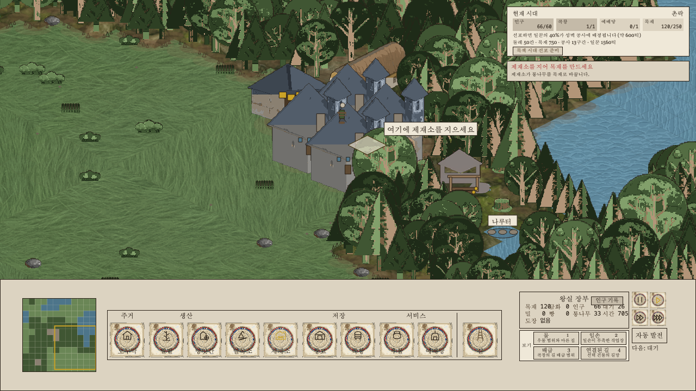
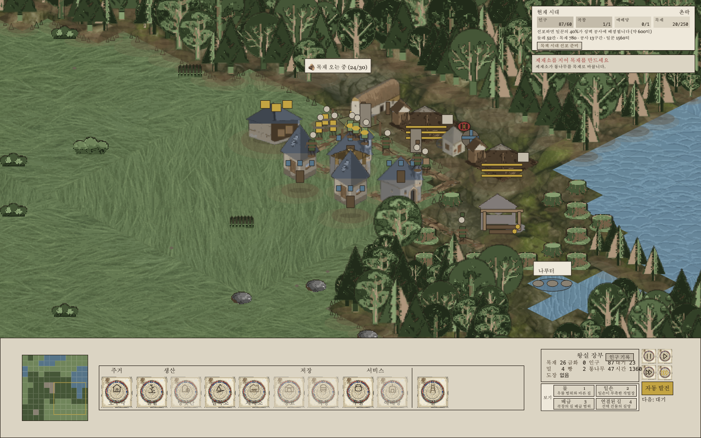
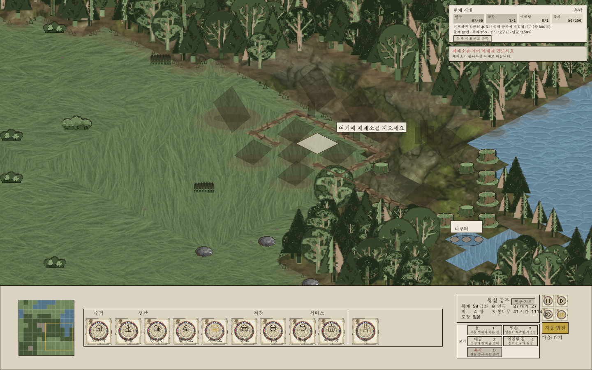
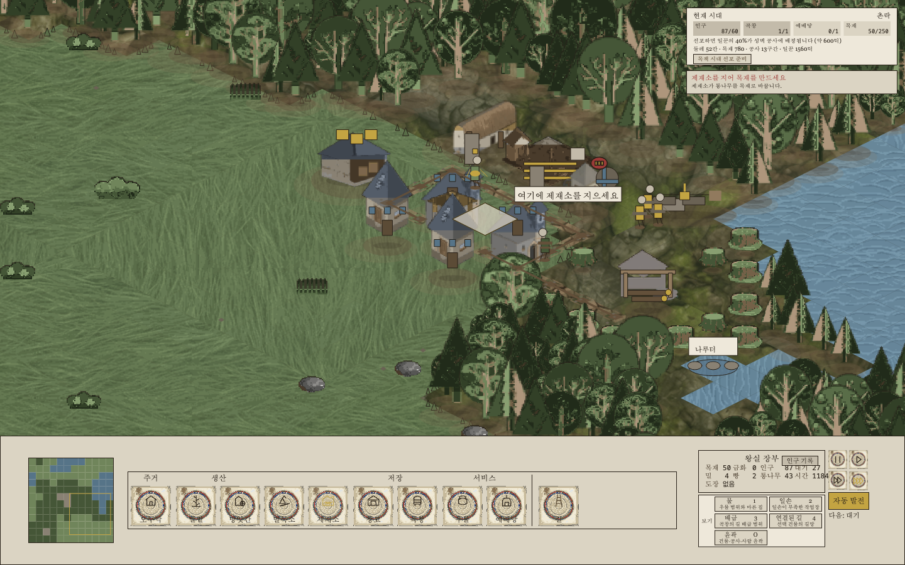

# Phase 14 — Scale, Occlusion, and Long-session Performance

## Outcome

The Phase 14 branch implements and pushes the three code priorities and evaluates the optional terrain refresh:

- world sprites now use manifest-driven render scales and a pre-scaled bitmap cache;
- crowded settlements keep roads and walkers readable, with cursor/density transparency and a presentation-only outline view;
- the recurring onboarding guidance scan that stalled long sessions was removed, and a clean-revision ten-minute browser profile now passes;
- three DGX terrain candidates were generated, processed, tiled, and reviewed, but none was good enough to ship. The original terrain remains in the product.

Product commits already pushed to `origin/codex/phase14-scale-occlusion-performance`:

| Part | Commit | Intent |
| --- | --- | --- |
| 1 | `8656fe9d1fe0d1c76a489f2cbc82097ee80b2d1c` | Reveal more of the settlement without sacrificing sprite detail |
| 2 | `f971e30de155e1b9aef72a19f31a35f5a0759a5c` | Keep village activity readable as settlements become crowded |
| 3 | `40b97501dc592d0ba71499ac82606ac28194e812` | Prevent long-session guidance scans from stalling play |

The report/evidence commit and the exact Pages build/deployment outcome are recorded in the final publication section.

## 1. Render scales and default camera

The runtime formula is:

```text
renderScale = targetTileRatio * 32 / authoredHeight
effectiveHeightPx = authoredHeight * renderScale
```

This normalizes each sprite family to a deliberate world-space height without regenerating its authored bitmap. The loader creates a high-quality scaled bitmap once and the draw path reuses that cached source instead of resampling every frame.

| Family | Assets | Target tiles | Effective height | Exact render scales |
| --- | --- | ---: | ---: | --- |
| Small dwellings | `house_l0`, `house_l1`, `well` | 1.8 | 57.6 px | `0.514286`, `0.480000`, `0.720000` |
| Working buildings | `mill`, `sawmill`, `logging_camp`, `masonry`, `quarry`, `wheat_farm` | 2.2 | 70.4 px | `0.440000`, `0.628571`, `0.676923`, `0.586667`, `0.586667`, `0.733333` |
| Large dwellings | `house_l2`, `house_l3`, `house_l4` | 2.6 | 83.2 px | `0.577778`, `0.433333`, `0.520000` |
| Storage | `barn`/`granary`, `storehouse`, `market` | 2.2 | 70.4 px | `0.488889`, `0.517647`, `0.517647` |
| Landmarks | `church`, `keep` | 3.2 | 102.4 px | `0.492308`, `0.441379` |
| Trees | oak large/small, pine tall/short, birch, dead | 2.0 | 64.0 px | `0.571429`, `0.800000`, `0.533333`, `0.727273`, `0.666667`, `0.800000` |

`granary` intentionally resolves to the existing runtime `barn` sprite. The stone wall remains at scale `1`; its segmented geometry is already authored at the intended world size.

At a 1440×900 viewport with 150 px reserved below the world, the default camera changed as follows:

| | Before | After |
| --- | ---: | ---: |
| Target isometric tile span | 20 | 14 |
| Computed default zoom | 1.125 | 1.607143 |
| Literal visible tile span | 20 | 14 |

Important clarification: raising the default zoom does **not** literally show more tiles; it reduces the target span from 20 to 14. The decision was kept because the sprites themselves were reduced substantially relative to the grid, and the higher camera zoom preserves small-building and worker legibility. The net result is a less obstructed settlement at a readable apparent size, not a larger literal tile count.

## 2. Ten-minute profile

### Actual degradation cause

The long-session stall was not an unbounded `GameState` collection. The onboarding world-guidance selector repeatedly cloned and rescanned the full tile map while trying hypothetical road layouts. Those counterfactual road scans could not unlock ordinary building placement, because building placement does not require a road. As the guidance loop repeated, browser callbacks developed multi-second gaps. The fix removed the generic hypothetical-road search and returns the direct valid target; explicit food-chain road guidance remains intact.

### Before diagnostic profile

The original profile measured time between callbacks, not callback execution work. It therefore revealed the stall and named the right hotspot, but its frame numbers are **diagnostic wall intervals** and are not directly comparable to the corrected after-profile callback-work values.

| Minute | Tick | Buildings / houses / walkers | Diagnostic avg | Diagnostic p95 | Max gap | Heap used |
| ---: | ---: | --- | ---: | ---: | ---: | ---: |
| 1 | 1,353 | 11 / 4 / 11 | 115.83 ms | 5.80 ms | 8,186.30 ms | 17.51 MB |
| 3 | 1,453 | 11 / 4 / 7 | 5,453.52 ms | 6,031.80 ms | 6,031.80 ms | 37.90 MB |
| 5 | 1,553 | 11 / 4 / 7 | 5,420.94 ms | 6,037.20 ms | 6,037.20 ms | 23.29 MB |
| 7 | 1,653 | 12 / 4 / 6 | 5,612.57 ms | 7,259.10 ms | 7,259.10 ms | 32.56 MB |
| 10 | 1,853 | 13 / 5 / 5 | 4,005.24 ms | 4,359.80 ms | 4,359.80 ms | 35.70 MB |

Source artifact: `/tmp/feudal-phase14/part3/profile-baseline/2026-08-09T23-25-21.666Z/profile.json`.

### Corrected clean-revision profile

The final tool measures actual requestAnimationFrame callback execution work. It ran against exact clean revision `40b97501dc592d0ba71499ac82606ac28194e812` with `revisionDirty: false`, autoplay enabled, 5× speed selected, and no console, page, resource, network, log, or runtime errors.

| Minute | Tick | Buildings / houses / walkers | Samples | Avg callback work | p95 | Max | >20 ms | Heap used |
| ---: | ---: | --- | ---: | ---: | ---: | ---: | ---: | ---: |
| 1 | 3,467 | 14 / 5 / 5 | 691 | 8.466 ms | 45.5 ms | 49.9 ms | 79 | 28.17 MB |
| 3 | 11,924 | 14 / 5 / 5 | 940 | 3.763 ms | 4.2 ms | 6.4 ms | 0 | 12.73 MB |
| 5 | 21,473 | 14 / 5 / 4 | 923 | 5.302 ms | 6.1 ms | 394.0 ms | 9 | 42.41 MB |
| 7 | 31,375 | 14 / 5 / 4 | 996 | 3.695 ms | 4.1 ms | 6.1 ms | 0 | 30.44 MB |
| 10 | 46,005 | 14 / 5 / 5 | 945 | 4.551 ms | 6.0 ms | 157.2 ms | 10 | 17.45 MB |

Minute 10 average callback work is 53.76% of minute 1; minute 10 p95 is 13.19% of minute 1. Both are below the required 120% ceiling. Heap use is not monotonic and ends below the minute-1 value. Isolated maximum spikes remain visible at minutes 5 and 10, so the profile proves stable central tendency rather than claiming that every single callback stayed below 20 ms.

Durable profile evidence: [profile JSON](asset-evidence/phase14/profile/phase14-long-profile.json), [minute 1](asset-evidence/phase14/profile/minute-1.png), [minute 3](asset-evidence/phase14/profile/minute-3.png), [minute 5](asset-evidence/phase14/profile/minute-5.png), [minute 7](asset-evidence/phase14/profile/minute-7.png), [minute 10](asset-evidence/phase14/profile/minute-10.png).

## 3. Collection bounds

No unbounded `GameState` array was found. A 12,000-tick regression traverses and validates the actual state collections, references, coordinates, walker paths/path indices, inventories/reservations, construction sites, houses, and path-cache bounds. It did not require truncation or periodic deletion to pass. The performance defect was the repeated full-map guidance computation described above, not collection accumulation.

## 4. Occlusion and readability

The final render order is:

1. terrain and the normal road base;
2. all non-walker world objects, depth sorted;
3. a narrow late road-readability overlay at alpha `0.72`;
4. walkers last.

Normal building alpha is `0.5` only when the rendered sprite bounds intersect the hovered isometric cursor diamond. A dense 5×5 window containing more than six buildings applies alpha `0.8`; when both conditions apply the product is `0.4`. Exactly six buildings does not trigger density fading. Walkers, construction sites, and adjacent non-overlapping buildings are unaffected by cursor fading.

The `O` shortcut and the Korean `윤곽` control select a presentation-only mode outside `GameState`. In that mode buildings, construction sites, and walkers use exact alpha `0.35`, overriding normal cursor/density alpha. The console legend is `건물·공사·사람 윤곽`.

## 5. Screenshots and manual QA

### Dense settlement before and after rescaling

Before, large dwelling sprites cover roads and neighboring walkers:



After, the same settlement family keeps the road graph, houses, production buildings, and multiple walkers simultaneously legible:



### Outline view and cursor transparency

The outline capture records the presentation-only silhouette mode with the welcome modal absent. Roads remain fully visible beneath the exact `0.35` building, construction-site, and walker alpha:



The separate cursor-overlap capture records normal mode with the pointer centered on `house-44-40-0` at tile `(44, 40)`. Only that intersected sprite fades while nearby roads, walkers, and buildings retain their own alpha:



The machine-readable capture state and image hashes are preserved in [occlusion-qa.json](asset-evidence/phase14/occlusion-qa.json). The paired captures have matching 1,440×900 dimensions, intact alpha channels, and a 91/100 objective similarity score; the central-town hotspots are the intended outline-alpha and transient-entity differences. Full output: [occlusion-image-diff.json](asset-evidence/phase14/occlusion-image-diff.json).

### QA result table

| Scenario | Result | Honest observation |
| --- | --- | --- |
| 1440×900 opening | PASS | Small buildings remain identifiable after pre-scaling; the UI and world fit without clipping. |
| 1440×900 dense autoplay | PASS | Roads, houses, storage/production sites, and multiple walkers are visible together. |
| Keyboard and button outline toggle | PASS | The final outline capture has `welcomeVisible: false`, `outlinePressed: true`, tick 1,099, 10 buildings, and 8 walkers. The earlier modal-obstructed capture was rejected and is not part of durable evidence. |
| Cursor overlap | PASS | At tick 1,169, the pointer intersects `house-44-40-0`; only that building sprite fades while 5 nearby walkers and neighboring buildings retain their own alpha. |
| 10-minute 5× profile | PASS | Tick 46,005 reached; minute-10 average and p95 remain within the 20% contract; no browser/runtime errors. |
| Restored original terrain at 1280×720 | PASS | Original grass loaded as PNG, canvas rendered 1,280×720, no asset failures or clipping. |

### Honest walker read

In the dense autoplay and long-profile captures I can follow the granary/house-route workers across the road network because walkers are rendered after every building and carry a contrasting head/body/cargo silhouette. They do not disappear behind a building in the captured frames. This is a frame-by-frame visibility conclusion from the renderer order plus the real captures, not an assertion that a human manually tracked one named walker continuously for the full ten minutes. The most visually ambiguous spot is the central road junction where several walkers overlap each other; there the individual identity can be lost briefly among other walkers, but not behind a building.

## 6. Terrain generation decision

Part 4 used an isolated DGX checkout at exact clean revision `40b97501dc592d0ba71499ac82606ac28194e812`. ComfyUI ran on an owned temporary port/session; the unrelated `feudal-sim` session was not reused or terminated. Three sequential 1,024×1,024 RGB candidates were generated and processed to 512×512:

| Asset | Raw colors | Processed colors | Shipped original colors | Decision |
| --- | ---: | ---: | ---: | --- |
| Grass | 111,990 | 42,610 | 6 | Reject — at the actual 32 px tile scale, photorealistic blades dominated roads and buildings. |
| Water | 41,833 | not retained as release | 4 | Reject — the embossed ripple repeated visibly in a 2×2 tile. |
| Packed-earth road | 95,211 | not retained as release | 6 | Reject — it read as cobblestone rather than packed earth. |

The processed grass seam measurements were acceptable numerically (outer seams `0/0`, join `8.8108/5.6017`), but numeric seam quality did not outweigh the failed in-game material/readability judgment. Water and road were rejected at the tiled-preview stage. Final product hashes confirm the originals were restored:

- grass: `0b1bd31a7bb647f9f73fb728f9619f86c05fd481ffc69710ebd70943714b8c14`
- water: `ff47499c738d90db40052b61fbf75424c8370d9d4ae2d0aa5b8fcc42eaf8b2d7`
- packed-earth road: `ee5b6bb22523d7ae39e3b7988f59185b111c82f43b6d0292aa7fcbf42ab04bdb`

Thus grass **was regenerated and evaluated**, but it was not released.

## 7. Decisions made for the owner

| Decision | Reasoning |
| --- | --- |
| Normalize by target effective height rather than modify source bitmaps | Preserves authored assets and allows deterministic, testable family-level scale. |
| Cache scaled bitmaps at load time | Avoids repeated high-quality resampling cost inside the frame loop. |
| Keep the higher default zoom despite the smaller literal tile span | The smaller normalized sprites otherwise become too small to read; report explicitly records the span tradeoff. |
| Render walkers last | Continuous worker visibility is more important than strict painter occlusion behind buildings in a management view. |
| Multiply cursor and density alpha in normal mode | Both independent readability signals remain observable; exact combined alpha is deterministic (`0.4`). |
| Make outline mode presentation-only | It cannot alter simulation state or determinism. |
| Remove generic hypothetical-road guidance scans | They were expensive and could not change ordinary building-placeability; specific road guidance remains. |
| Reject all three terrain candidates | Real game-scale visual judgment outweighed generation effort and raw color count. Shipping a worse material would violate the readability goal. |

## 8. Review record and two-round cap

The code review and both final visual-QA passes returned PASS after two rounds, with no remaining code or visual blocker. The report audit retained one owner-decision objection after its second and final round; it is accepted and recorded below under the mandated two-round cap rather than sent through a third loop.

The material objections raised before finalization were resolved rather than waived:

> “The clean-revision performance evidence is not yet bound to the pushed Part 3 SHA; the report is missing; and the proxy performance sentinel duplicates behavior rather than proving the runtime path.”

Resolution: the duplicate proxy test was removed, the clean browser run was repeated at exact `40b97501...` with `revisionDirty: false`, and this report plus its durable evidence was added.

> “Part 4 cannot be accepted while a verifier relaxation is added to an oversized test file and the release decision artifact is absent.”

Resolution: no generated terrain was released, so the tentative verifier/test change was removed entirely. The original terrain hashes were restored and the rejection rationale is recorded above. There was no second-round objection to override.

> “The attachment required both higher default zoom and seeing more tiles; the report documents a deliberate tradeoff instead, so it does not satisfy the original brief as written.”

Accepted owner decision after round 2: those two requirements oppose each other in the current camera formula. Phase 14 prioritizes the explicitly raised default zoom and the normalized smaller sprites so buildings and walkers remain readable. The literal visible span is therefore 14 rather than 20, and the unmet “more tiles” wording remains disclosed in section 1 instead of being hidden or reinterpreted.

The first-round screenshot objection was resolved by rejecting the modal-obstructed artifact and replacing it with separate modal-free outline and cursor-overlap captures. The final code reviewer and both visual passes then returned PASS. The report auditor's publication objection is a sequencing dependency and is closed only by the commit and Pages workflow recorded in section 10.

## 9. Verification and determinism

Fresh post-report verification on this branch produced:

| Command | Result |
| --- | --- |
| `npm run typecheck` | PASS, `tsc --noEmit` |
| `npm test` | PASS, `1,030/1,030`, 18 suites, 0 failed, 101.45 s |
| `npm run build` | PASS, 194 modules, JS 452.79 kB / gzip 137.66 kB |
| `npm run harness -- --workers=8` | PASS, all 14 canonical metric rows plus advisor provenance/autoplay |
| `git diff --check` | rerun immediately before commit |

Harness identity:

- determinism: `b82a6e26498392c5 == b82a6e26498392c5`;
- legacy Stage 2: `5a393f13af3e61be`;
- Stage 3: `2338ddb7b73d987b == 2338ddb7b73d987b`;
- autoplay advisor: `089908bea7d76ebc == 089908bea7d76ebc`.

The earlier focused Phase 14 suite was `21/21` PASS. The full fresh run above includes those tests and is the final completion evidence.

## 10. Publication

- Git remote: `https://github.com/hyunlord/feudal-lord-simulator.git`
- Branch: `codex/phase14-scale-occlusion-performance`
- Public URL: `https://hyunlord.github.io/feudal-lord-simulator/`
- Product head before report: `40b97501dc592d0ba71499ac82606ac28194e812`
- Report/evidence commit: `443ecaf905c13350910e970699cd2eba9d6e6433`
- GitHub Pages workflow run: [31348519611](https://github.com/hyunlord/feudal-lord-simulator/actions/runs/31348519611), exact head `443ecaf905c13350910e970699cd2eba9d6e6433`
- Pages build job `93334879400`: PASS in 7m10s; checkout, dependency install, typecheck, all tests, Pages build, configuration, and artifact upload succeeded
- Deployment `5825145001`: **FAIL**, status `16594518041`; the `github-pages` environment rejected the feature branch because its only allowed branch policy is `main`
- Current public deployment: `cdb831a4546658a439d1aed96733e4021b04c741` from successful deployment `5818784532`; the public URL returns HTTP 200, but it remains the Phase 13 build
- Final publication status: **PARTIAL / BLOCKED BY ENVIRONMENT POLICY**. Phase 14 is pushed and its Pages artifact is verified, but it is not publicly deployed. Closing this requires either merging the reviewed branch into `main` or an authorized change to the `github-pages` environment policy; neither external production change was performed implicitly.
