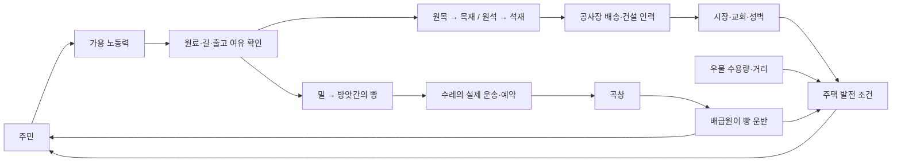

# 도시 성장·가림·공급망 검증 — 2026-09-20

## 화면을 읽는 방법

이 보고서의 도시 화면은 실제 엔진으로 초기 마을부터 성장시킨 상태를 개발판에 불러와 캡처한 것이다. 자원·시설·주민을 캡처용으로 추가하지 않았다. 전체 성장 시간을 브라우저 클릭으로 재생한 것은 아니다. 도로 삭제·복구는 별도의 실제 UI 조작으로도 확인한다.

도로·성벽 비교판은 오류를 분리하기 위한 합성 배치이며, 실제 제품 렌더러와 실제 에셋을 Chrome에서 그린 것이다. 도시 콘셉트 그림이나 새로 생성한 삽화가 아니다.

## 도로·성벽이 집을 침범하던 원인

1. **도로 덧그림 순서**: 건물을 그린 뒤 길을 다시 덧칠하는 패스가 지붕까지 지나갔다. 같은 도로 표현을 모든 입체 물체보다 먼저 그리도록 옮겼다.
2. **자동 반투명**: 밀집 지역과 마우스가 올라간 건물을 자동으로 흐리게 만들어 뒤 성벽·도로가 집을 통해 보였다. 일반 모드에서는 불투명하게 유지한다. 사용자가 선택하는 윤곽 진단 모드는 별도다.
3. **공사장 누락**: 성벽 확정 때 완성 건물만 검사해 먼저 착공한 건물 위로 성벽 계획을 놓을 수 있었다. 제안·미리보기·최종 확정·자동 건설이 같은 점유 계산을 사용하며, 건물 공사장의 전체 면적도 포함한다.

도로와 건물은 같은 논리 칸을 점유할 수 없다. 성벽과 건물/건물 공사장은 최소 한 칸 간격을 확보한다. 합필 주택은 두 칸 전체를 검사한다. 앞에 있는 성벽이 뒤 건물의 낮은 부분을 가리는 정상적인 등각 가림은 유지한다. 기존 저장 데이터의 불법 배치를 자동으로 옮기지는 않는다.

## 서로 연결된 시뮬레이션

| 시스템 | 실제 구현 | 플레이에서 생기는 결과 |
|---|---|---|
| 인력 | 주민의 절반이 노동력이며 식량 핵심 시설을 우선 배정. 신규 입주자는 다음 틱부터 일함 | 인구가 부족하면 생산·시장·건설이 동시에 무한 가동되지 않음 |
| 생산 | 필요한 길·일꾼·원료·출고 공간을 검사 | 농장만 지어서는 빵이 생기지 않고 운송·방앗간·곡창이 필요함 |
| 운송 | 출발 시 재고/도착 공간을 예약하고 수레가 실제 경로로 이동. 단절·취소 시 예약도 정리 | 재고가 존재해도 길이 끊기면 원료나 공사 자재가 도착하지 않음 |
| 식량 | 곡창의 배급원이 집에 빵을 공급. 주민 8명당 빵 1개를 400틱마다 소비 | L4로 인구가 늘면 생산량과 배급 거리를 함께 감당해야 함 |
| 물 | 우물 반경 6, 최대 12 주거 필지 | 우물 가까이에 있어도 수용량 초과 시 추가 우물이 필요함 |
| 시장 | 반경 8, 연결 도로, 일꾼 3명, 최대 24필지 | 가까운 시장이라도 길·직원이 없으면 주거 서비스가 중단됨 |
| 교회 | 반경 12, 연결 도로, 최대 32필지 | 건물 유무만으로 전체 도시가 자동 혜택을 받지 않음 |
| 발전 | L1 물, L2 물+빵, L3 물+빵+인근곡창, L4 물+빵+시장+교회+완성성벽 보호 | 배치·공급망·공공시설의 조합으로 발전함 |
| 퇴화 | 필요 조건 부족 400틱 누적마다 생활등급 한 단계 하락. 최고 건축단계는 보존 | 도로가 끊겨도 석재·목골조 집이 갑자기 초가집으로 바뀌지 않음 |

서비스 수용량의 단위는 주민 수가 아니라 **필지**다. 단독 주택은 1, 합필 주택은 2이며 빈집도 자리를 유지한다. 실제로 가능한 공급자가 적은 집부터 배정하지만 복잡한 임의 네트워크의 전역 최적 배분을 보장하는 알고리즘은 아니다.

## 자동 성장과 자재 판매의 연결

기존 자동 개발은 성곽 목표 이후 도로 정비 정도만 수행했고, 초기 시장은 주거지에서 멀리 떨어진 채 남았다. 이제 석벽 도시 이후에도 서비스가 부족한 주택을 찾아 기존 시설까지의 길을 먼저 복구하고, 필요한 범위·수용량을 늘리는 시설을 실제 건설한다. 짓는 중인 시설이나 단순 일꾼 부족 때문에 같은 시설을 계속 복제하지 않는다.

시장은 연결된 창고의 잉여 재고를 팔아 코인을 얻는 별도 경제 기능도 가진다. 이전 목재 60·석재 40 보유 기준만으로 판매하면 교회 비용 100·60이 모이지 않았다. 필요한 교회 한 채의 자재와 착공 후 아직 배송·예약되지 않은 잔여 자재를 보호한다. 배송되었거나 이미 운송 예약된 물량은 중복으로 묶지 않는다. 공사가 완료되어 필요가 사라지면 추가 보호를 해제한다. 이 판매 규칙은 자동 개발뿐 아니라 수동으로 짓는 도시에도 적용된다.

주민 증가 뒤에는 기존 식량 체인 확장 판단도 계속 실행한다. 새 식량 시설은 합법적인 배치·건설 경로를 지키면서 도달 가능한 곡창까지의 실제 도로 경로 길이 합으로 후보를 정렬한다. 직선으로 가까워도 건물·성벽 때문에 운송길이 길어지는 위치를 피하고, 다른 곳의 단절된 곡창 하나 때문에 정상 연결 구역의 확장까지 막히지 않게 한다. 자원 추가, 비용 면제, 무료 완공, 주민 수 강제 변경을 사용하지 않는다. 지상 도로 무료·교량 목재 비용 등 기존 규칙도 바꾸지 않는다.

## 구현의 범위

- 우물 방문·예배·시장 쇼핑을 주민 한 명씩 시뮬레이션하지는 않는다. 물·시장·교회 서비스는 거리·도로·인력·수용량 판정이다.
- **시장이 빵을 집으로 배달하는 것은 아니다.** 빵은 곡창 배급원이 운반한다. 시장 주거 서비스와 창고 잉여재고 판매를 구분한다.
- L3의 곡창 조건은 인접 반경 검사이고, 실제 빵 공급은 별도 운송·배급 경로를 따른다.
- 주택 조건 회복 시 생활등급은 빠르게 돌아올 수 있다. 등급별 별도 승급 공사는 아직 없다.
- 이번 가림 수정은 자산의 화풍·크기 전체를 재설계한 것이 아니다. 화면의 전반적인 자연스러움과 성능은 계속 개선할 부분이다.

## 최종 관찰 결과

수정 없는 기본 시작 상태에서 정상 자동 개발·reducer·엔진 틱만 사용했다. 389726틱에 기존 승리 조건, 400128틱에 물·시장·교회 각각 8/8가구 공급을 달성했다. 403877~415877의 **매 틱 12000틱 연속** 8가구 L4·각 32명·총 256명·모든 서비스·미완료 공사 0을 유지했다. 거부된 자동 행동과 음수/비정상 재고는 0이다.

같은 상태에서 추가 12000틱(427877까지) 매 틱 관찰했다. 모든 집이 L4·32명을 유지했고, 빵 재고가 0이 된 틱과 퇴화 횟수는 0이었다. 재고 증가량으로 집계한 재공급 추정치는 각 집 빵 120개씩 총 960개이며 추가 자동 건설은 없었다. 최초 구간과 합쳐 24000틱의 인구·등급 안정성을 확인한 것이며, 무한 시간이나 임의 도시 배치의 안정을 보장하지 않는다.

자연 도시의 한 집에서 실제 reducer로 인접 길 3개를 지웠다. 시장·교회 연결은 즉시 끊겼고, 401틱 뒤 생활등급 3·건축단계 4가 되었다. 길을 복구한 뒤 23틱에 새 배급이 도착해 빵 12·생활등급 4로 회복했다. 별도의 Chrome UI에서도 길 도구로 같은 3개 길을 삭제·재건하여 서비스 표시 변경을 확인했고 브라우저 오류는 0이었다.

## 직접 보는 화면

- 오류 재현용 실제 렌더러 배치: [수정 전](verification/town-systems-v2/occlusion-before.png), [수정 후](verification/town-systems-v2/occlusion-after.png).
- 자연 엔진 성장 상태를 실제 개발 UI에서 확인: [도시·L4 주택과 공급 상태](verification/town-systems-v2/grown-town-house.jpg), [교회](verification/town-systems-v2/grown-town-church.jpg), [시장](verification/town-systems-v2/grown-town-market.jpg).
- 같은 자연 도시의 길 단절 실험: [생활등급 하락·건축 외형 유지](verification/town-systems-v2/strained-house.jpg), [복구·새 배급 도착](verification/town-systems-v2/recovered-house.jpg).

## 변경 파일과 검증 범위

- `drawObjectRenderItems.ts`, `drawBuildings.ts`, `occlusionModel.ts`: 도로 그리기 순서 수정과 자동 반투명 계산 삭제.
- `palisadeFootprints.ts`, `palisade.ts`, `autoplayActions.ts`, `eraConsoleModel.ts`: 세 군데 중복 점유 계산을 하나로 합치고 공사장 포함.
- `autoplay.ts`, `autoplayServices.ts`, `autoplayFoodPlacement.ts`: 실제 서비스 부족과 운송 경로를 고려한 자동 개발.
- `autoplayCivicReserve.ts`, `marketSettlement.ts`, `tick.ts`: 필요한 교회 공사 자재의 잉여 판매 방지 및 현재 공사 상태 반영.
- 관련 회귀 테스트, `DESIGN.md`, `DEVELOPMENT_STATUS.md`, 이 보고서와 검증 자료.

[최종 검사 기록](verification/town-systems-v2/final-validation.md)을 함께 확인한다. 과거 저장 데이터의 불법 배치 자동 이주, 전역 물류 최적화, 개인별 시장 방문과 화면 화풍 전면 교체는 이번 구현에 포함하지 않는다.
