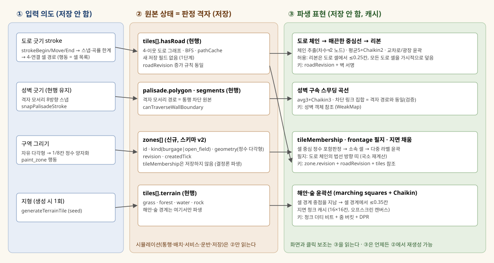
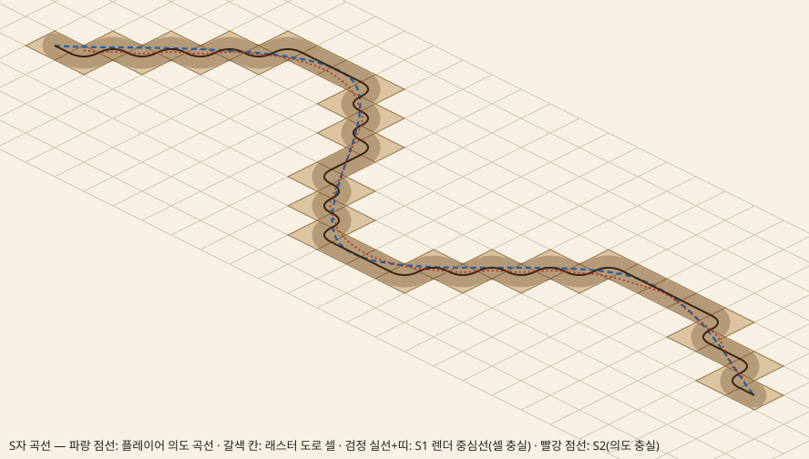
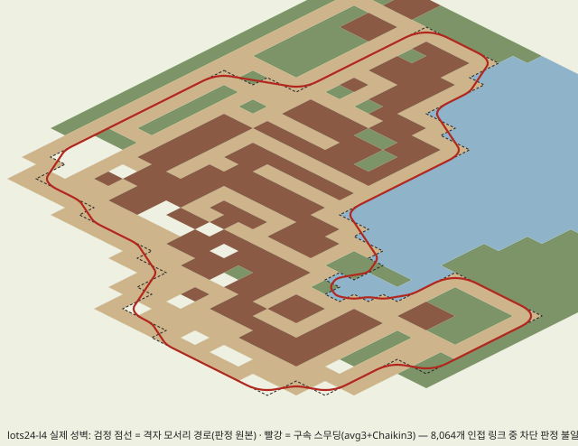
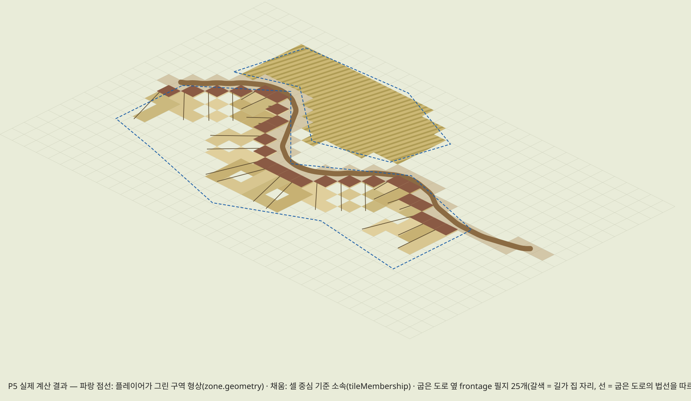

# 유기적인 땅: 곡선 경계·구역·성벽을 한 구조로 (설계 응답 v3)

| 항목 | 값 |
|---|---|
| 분석 기준 커밋 | `c26f9af8ae38bf760acf7e7ce01bd9f63ab2a76f` (`origin/codex/phase15-organic-ground`, 2026-09-24 12:38 KST, "Keep wall deliveries alive when the nearest road cannot reach home"). A⁵ 커밋 `e89dc12…c26f9af` 포함 |
| 저장 분석 기준 | `origin/claude/b8-save` `dd19986` (체크아웃 없이 `git show`로 읽음) |
| 작업 방식 | `/tmp/fls-design` detached worktree, 읽기 전용. 저장소 무변경, 새 브랜치 없음 (§11 검증) |
| 참고한 R1 | `~/feudal-lord-analysis/R1/` 전체(SUMMARY, S0–S8, 성능용 상태 3종 `new-game`·`pop176`·`lots24-l4`). 연결점은 §11.2 |
| 증거 | `probes/`의 탐침 5종과 출력, `figures/`의 도식 5종. 제품 코드가 아니다 |
| 표기 | "현재 구조"는 코드에 있는 것만 쓰고 `경로:함수:줄`로 근거를 단다. 추정은 **(추정)**, 제안은 **(제안)**으로 표시한다 |

---

## 1. 원칙 한 문장

> **판정의 원본은 언제나 격자(셀과 격자 모서리)이고, 곡선은 그 원본에서 결정론적으로 파생된 표면이다. 플레이어가 그린 곡선은 의도로만 쓰여 셀로 스냅되고, 화면은 스냅된 결과를 보여 준다. 그래서 화면에 보이는 모든 곡선은 판정 셀과 정해진 허용 오차 안에서 일치한다.**

풀어 쓰면 이렇다. 셀이 곡선을 따라간다. 곡선이 셀을 속이지 않는다. 새로 저장하는 것은 파생할 수 없는 의도뿐이며, 1단계에서는 **구역 형상 하나**다.



---

## 2. 현재 구조와, 곡선을 넣으면 깨지는 가정

### 2.1 좌표·격자

- 세계는 `Tile{tx,ty,terrain,buildingId,hasRoad}`의 평면 배열이다 (`src/world/world.types.ts:Tile:5-11`). 크기는 64×64 (`src/state/gameStore.ts:47-48`, R1 상태 3종에서 모두 4,096칸).
- 투영은 2:1이다. `TILE_W=64`, `TILE_H=32`이고 `tileToScreen`은 셀 **중심**을 반환한다 (`src/render/iso.ts:1-14`). 역변환 `screenToTile:16-24`은 실수를 돌려주고, `src/render/picking.ts:pickTile:26-47`이 주변 3×3 마름모 포함 판정으로 셀을 확정한다.
- 좌표계는 두 가지다. **셀 좌표**에서는 셀 (tx,ty)의 중심이 (tx,ty)다(렌더). **모서리 좌표**(`TileEdgePoint`)에서는 셀 중심이 (tx+0.5, ty+0.5)이고 정수점이 격자 모서리다 (`src/world/wallTraversal.ts:canTraverseWallBoundary:101-102`). 이 설계의 새 기하는 모두 **모서리 좌표**를 따른다(§4.0).
- 깊이 정렬 키는 `tx+ty`다 (`src/render/iso.ts:depthKey:26-28`).

### 2.2 도로

| 사실 | 근거 |
|---|---|
| 도로는 셀 불리언 하나다 | `world.types.ts:10` `hasRoad` |
| 드래그는 **양 끝점만** 쓴다. 우세 축 한 줄로 바꾸고, 대각 동률은 가로로 보낸다 | `src/world/roadGraph.ts:roadLine:21-42`, `src/render/canvasDragResolution.ts:finishedRoadAttempt:86-95` |
| 검증기가 직선이 아니면 거부한다 | `src/engine/roadPlacement.ts:roadPlacementAssessment:27-28` (`first.tx !== last.tx && !horizontal → wrong_terrain`) |
| 기존 도로 칸은 건너뛰고 새 칸만 설치한다 (A⁵ 결정) | `roadPlacement.ts:13,23` (`existingTiles`/`newTiles` 분리) |
| 다리는 한 축의 곧은 물 구간, 최대 8칸, 양쪽 둑이 풀이어야 한다 | `src/world/bridges.ts:bridgeAt:11-34`, `BRIDGE_MAX_WATER_TILES=8:4`, `roadPlacement.ts:29-40` |
| 행동은 `place_road_line{start,destination}`이다. 자동 개발도 같은 행동을 쓴다 | `src/state/gameStore.types.ts:30`, `src/engine/autoplayActions.ts:56-57`, `src/engine/gameActions.ts:placeRoadLine:57-64` |
| 그래프는 4-이웃이다. 경로는 N,E,S,W 순서 BFS다 | `roadGraph.ts:getOrthogonalRoadNeighbors:44-56`, `findExistingRoadPath:111-143` |
| 건물 접근 칸은 발자국 사각형의 변 이웃뿐이다 | `src/engine/routing.ts:buildingRoadAccessTiles:103-124` |
| 경로 캐시 키는 `roadRevision` + 완공 성벽 서명이고, 건물 쌍은 정규 순서로 묶는다(A⁵ F6) | `routing.ts:cacheKey:32-38`, `buildingPairCacheKey:62-64`, `resolveBuildingRoute:220-251` |
| 렌더는 셀마다 원형 중심, 4방향 팔, 모서리 호를 **매 프레임** 만든다. 폭 반경은 약 0.208칸이다 | `src/render/organicRoadGeometry.ts:roadGroundPolygons:15-56`, `src/render/drawTerrainDetails.ts:drawRoadPath:56-77` |
| 도로 무늬는 셀마다 아직 **clip**을 쓴다 | `drawTerrainDetails.ts:94-108` |

### 2.3 성벽

| 사실 | 근거 |
|---|---|
| 경로는 격자 모서리 정수점의 닫힌 다각형이다. 8방향 단위 걸음으로 래스터된다 | `src/world/palisadeGeometry.ts:rasterSegment:188-197`, `snapPalisadeStroke:199-204`, `CARDINAL_AND_DIAGONAL_STEPS:75-84` |
| 유효성: 닫힘, 범위, 자기교차, 물 횡단, 포위율, 건물 간격 1 | `palisadeGeometry.ts:validatePalisadeCandidate:446-468`, `palisadePathHasBuildingClearance:243-263` |
| **통행 차단은 기하 판정이다.** 두 셀 중심을 잇는 선분이 완공 벽 선분과 교차하는지 본다. 성문 주변 `GATE_HALF_CLEARANCE=0.8`은 비운다 | `src/world/wallTraversal.ts:canTraverseWallBoundary:89-106`, `solidSegments:51-76`, `:4` |
| 구간은 4걸음 단위 공사장이다 | `src/engine/palisadeSegments.ts:PALISADE_SEGMENT_SITE_STEPS=4:12`, `segmentPalisadePathForConstruction:43-55` |
| 벽을 따라 운반: 링 걸음마다 인접 안쪽 셀을 노드로 삼고, 대각 한 번은 맨해튼 2로 센다 | `src/engine/wallCarryRoute.ts:adjacentTiles:32-41`, `wallNetwork:43-96`, `docs/wall-carry-contract.md` |
| 석벽 렌더는 걸음마다 한 조각이다. 원본 스프라이트를 **임의 방향 선분에 아핀 사상**한다(대각은 `axis:null`) | `src/render/stoneWallGeometry.ts:stoneWallTransform:15-20`, `stoneWallPieces:22-46` |
| 벽은 래스터 캐시를 쓰는 정렬 대상이다. 벽↔건물 순서 그래프가 있다 | `src/render/drawPalisadeSegments.ts:47`, `src/render/worldRasterCache.ts:drawCachedWorldRaster:18-78`, `src/render/objectRenderSort.ts:8-52` |

### 2.4 지형·지면 렌더

| 사실 | 근거 |
|---|---|
| 지형은 `grass·forest·water·rock` 4종이다. fbm 임계값으로 만들고 작은 영역을 제거한다 | `src/content/terrainConfig.ts:1`, `src/world/terrain.ts:generateTerrainTile:72-83`, `removeSmallRegions:130-148` |
| 지면 캐시가 **없다.** 보이는 셀마다 마름모를 최대 3번 채운다(기본색, 무늬 α0.6, 변이색) | `src/render/drawTerrain.ts:drawTerrain:56-88`, `drawGroundDiamond:165-192` |
| Phase 17은 셀별 clip을 직접 패턴 채움으로 바꿨다(`d08f572`). DPR2 정지 중앙값 83.3→33.4ms | `docs/verification/phase17/performance.md` |
| 최신 계측(Phase 20): 렌더 CPU DPR2 31.0/33.1ms(p50/p95), DPR1 22.1/23.6ms, 틱 1.7/2.3ms | `docs/verification/phase20/final-validation.md:8` |
| 숲 가장자리는 셀 변마다 해시 잡음 물결이다(`forestEdgeContour`). 변 하나에 최대 6번 채운다 | `src/render/forestFringeGeometry.ts:5-28`, `src/render/drawTerrainSeams.ts:drawTerrainTransitions:44`, `:73-104` |
| 물은 보이는 물 마름모 전체를 한 경로로 한 번 채운다 | `src/render/drawWater.ts:drawHistoricalWater:8-24` |
| 농지는 2×2 건물이다. 흙을 농지마다 매 프레임 clip해서 그린다 | `src/content/buildingConfig.ts:128-131`, `src/render/farmAssets.ts:drawFarmSoil:126-139` |
| 성내 경관(채소밭·과수·목초지)은 8×8 블록 해시로 고른 2×2 장식이다. 판정에는 영향이 없다 | `src/render/townLandscape.ts:townLandscapeAt:11-31` |
| 집 앞마당 방향은 인접 도로 S,E,W,N 순서의 첫 칸, 즉 4방향뿐이다 | `src/render/houseFrontage.ts:ROAD_PRIORITY:14-16`, `buildingFrontage.ts:50-55` |

### 2.5 서비스·자동 개발·입력·저장

- **서비스 거리는 발자국 사이 맨해튼 간격**이다. 도로는 같은 연결 요소인지만 본다 (`src/geometry/buildingDistance.ts:axisGap:4-10`, `buildingFootprintDistance:12-17`, `src/population/serviceAllocation.ts:62-65`, `src/engine/marketService.ts:6-23`). 우물 6, 시장 8, 교회 12 (`buildingConfig.ts:83,253,267`).
- 배급원: 4-이웃 보행, 교차로에서 가중 난수, `DISTRIBUTOR_RANGE=40`걸음 (`src/agents/roamingStep.ts:chooseNextTile:45-77`, `src/content/balanceConfig.ts:8`).
- 자동 개발은 직선 도로만 긋는다. 탐색은 4-이웃 BFS다. 부지는 격자 순서로 훑는다 (`src/engine/autoplayConstructionRoads.ts:searchRoad:39-72`, `src/engine/autoplayRoadPrefix.ts:6-19`, `src/engine/autoplay.ts:findBuildSite:77-91`, `housingAction:187-201`).
- **구역 개념이 없다.** `src/ui/predictionTypes.ts:4`에 주석 한 줄이 있을 뿐이다.
- 입력 의도 층은 두 곳에 있다. 게임 행동 `GameAction` 합집합(`gameStore.types.ts:14-52`)과 성벽 초안 `PalisadeDraftIntent`(`src/render/palisadeDraftInteraction.ts:50-55`, `applyPalisadeIntent:57-141`)다. 카메라 입력은 이동·확대만 있고 드래그 문턱은 4px다 (`src/render/gameCanvasRuntimeInput.ts:34,60-64`).
- **저장**(`claude/b8-save`):
  - `SAVE_SCHEMA_VERSION=1`(`src/save/saveTypes.ts:5`). GameState 전체를 그대로 스냅샷한다(`saveCodec.ts:toSnapshot:37-39`).
  - 이주는 한 단계씩 잇는 사슬이다(`src/save/migrations/index.ts:11-13,29-43`).
  - 스키마 감시는 상태의 `path:type` 모양과 **GameState 인터페이스 키를 정규식으로** 해시한다(`src/save/schemaFingerprint.ts:schemaShape:43-50`, `declaredGameStateKeys:53-56`).
  - `pathCache`는 저장하며 결정론에 필요하다(`docs/verification/b8-save/path-cache.json`, 비우면 결과가 달라짐). `roadRevision`도 저장한다.

### 2.6 곡선 도입 시 깨지는 가정 (목록)

| # | 가정 | 근거 | 곡선에서 | 이 설계의 처리 |
|---|---|---|---|---|
| G1 | 도로 긋기 = 끝점 두 개의 직선 | `roadLine:21-42`, `roadPlacement.ts:27-28`, `placeRoadLine:57-64` | **깨짐** | 셀 경로 행동 `place_road_path`, 검증기를 "4-연결 경로"로 일반화(§7) |
| G2 | 다리는 곧은 한 축 | `bridgeAt:11-34` | 유지 | 곡선 도로도 물 위 구간만은 축 직선으로 스냅(§4.1 S-water) |
| G3 | 도로 모양 = 셀별 4팔 다각형 | `roadGroundPolygons:15-56` | **깨짐**(계단이 보임) | 체인 중심선 + 리본(§4.1, §5) |
| G4 | 도로 그래프 4-이웃, 맨해튼 비용 | `getOrthogonalRoadNeighbors:44-56` | 유지(의도) | 대각 도로는 보이는 길이의 약 1.4배 걸음이 든다. 사용자 결정 Q1 |
| G5 | 접근 칸 = 발자국 변 이웃 | `buildingRoadAccessTiles:103-124` | 유지 | 건물은 축 정렬 그대로 |
| G6 | 서비스 거리 = 맨해튼 발자국 간격 | `buildingDistance.ts:12-17` | 영향 없음 | 곡선과 무관 |
| G7 | 성벽 = 격자 모서리 경로, 기하 교차 판정 | `wallTraversal.ts:89-106` | 유지 | 렌더만 구속 스무딩, 차단 집합 동일성 검사(§4.2) |
| G8 | 지형 경계 = 셀 변 단위 해시 물결 | `forestFringeGeometry.ts:5-28` | **깨짐**(셀 윤곽이 드러나고 1절이 금지한 '무작위 흔들림'과 같은 종류) | 라벨장 윤곽선(§4.3) |
| G9 | 지면은 매 프레임 셀별로 다시 그림 | `drawTerrain.ts:56-88` | **위험**: 곡선 채우기를 얹으면 비용이 더 는다 | 지면 청크 캐시(§5.3) |
| G10 | 경작지 = 2×2 농지 건물 + 사각 흙 clip | `farmAssets.ts:126-139` | **깨짐**(사각 필지) | 경작지 구역의 지면 무늬(§4.4, §5) |
| G11 | 성내 경관 = 8×8 블록 해시 장식 | `townLandscape.ts:11-31` | **깨짐**(무작위 배치) | 구역 소속 셀이 대신함 |
| G12 | 앞마당 방향 4개 | `houseFrontage.ts:14-16` | 부분 | 건물은 그대로, 앞길만 리본에 닿게 굽힘 |
| G13 | 구역 없음 | `predictionTypes.ts:4` | 신규 | `zones[]`(§4.4) |
| G14 | 저장 = 상태 전체, v1 | `saveTypes.ts:5` | 신규 필드 = v2 | §4.6 |
| G15 | 깊이 = `tx+ty`, 벽 앵커 = 경로 최대 깊이 | `iso.ts:26`, `palisadeRenderGeometry.ts:50-60` | 부분 | 곡선 벽 조각마다 깊이(§5.2) |

---

## 3. 구조 비교와 권고 (6.1)

| 항목 | (가) 격자 + 렌더 경계만 부드럽게 | (나) 격자 판정 + 곡선 경로·구역 형상 (**권고**) | (다) 자유 좌표 |
|---|---|---|---|
| 요지 | 입력·데이터는 그대로 두고 셀 경계만 둥글게 그린다 | 곡선 긋기와 구역 그리기는 입력 보조다. 판정은 셀 래스터로 한다. 곡선 렌더는 셀과 격자 모서리에서 파생한다 | 건물·도로·구역을 실수 좌표로 두고 내비메시·다각형으로 판정한다 |
| 구현 비용 | 작음(렌더만) | 중간. 렌더 파이프라인, 도로 행동 1종, 구역 1종, 채우기 에이전트 | 매우 큼. 경로·배치·서비스·운반·저장·자동 개발을 다시 씀 |
| 저장 호환 | 무변경 | 1단계는 `zones[]` 하나(v2). 도로·성벽은 저장 무변경 | 전면 비호환. 기존 저장 이주 불가 |
| 성능 | 캐시가 있으면 이득 | 같음. 곡선 채우기는 청크 캐시로 흡수(§5.3) | 판정 비용 증가, 결정론 비용 큼 |
| 입력 | 도로가 여전히 직선 | 곡선 긋기, 스냅 규칙, 컨트롤러 경유점 | 가장 자유로우나 스냅이 없으면 모호함 |
| 검증 난도 | 낮음 | 중간. 허용 오차를 **숫자로** 검사할 수 있음(§4, 탐침 P1·P2·P5) | 높음. 부동소수 결정론, 교차 판정 |
| 목책 직접 긋기·벽 따라 운반 | 무변경 | 무변경. 벽 원본은 격자 모서리 그대로 | 운반 그래프(`wallCarryRoute`)를 다시 씀 |
| 기존 도로 건너뛰기(A⁵) | 무변경 | 유지. `existingTiles`/`newTiles` 분리를 경로 전체에 그대로 씀 | 다시 정의해야 함 |
| 구역(v2 결정) | 구역을 셀로 칠함. 경계는 계단 | `zone.geometry` 보존, `tileMembership` 파생 = v2 결정 그대로 | 구역 = 다각형 판정. v2 결정과 충돌 |
| 목표 도달 | 도로·필지가 굽지 않음. **목표 미달** | 도로·성벽·해안·구역이 둥글게 보이고 판정과 일치 | 도달하나 5절 1·3·6 위반 |

**권고: (나).** 판정 격자를 그대로 두는 대신 "곡선은 셀의 결정론적 파생"을 단일 규칙으로 삼는다. (가)는 (나)의 1단계 부품(지면 캐시·윤곽선 렌더)으로 흡수된다. (다)는 5절 1(판정은 격자), 3(저장 호환), 6(점진 이행)을 구조적으로 만족할 수 없으므로 권하지 않는다. 증명 의무도 지지 않는다.

**(나) 안의 세부 선택**(탐침 결과로 정함):

1. **도로 렌더 원본 = 셀 체인** (저장 무변경). 곡선 제어점 저장은 2단계 선택지로 미룬다(Q2).
   - 탐침 P1에서 셀 중심을 그대로 매끄럽게 한 S1은 계단을 **뱀처럼 다시 그렸다**(그림 F2).
   - 평균 5 + Chaikin 2(S2)는 의도에서 최대 0.39칸 벗어난다. 리본은 모든 사례에서 도로 셀로부터 0.25칸 안에 있었다.
   - 끝 셀 2개를 뺀 모든 도로 셀을 리본이 가시적으로 덮었다(`probes/p1b-road-8conn.out.txt`).
2. **도로 그래프는 4-연결 유지.** 명시적 대각 링크(8-연결)도 시험했다(P1b). 시각 이득은 정확히 45°일 때만 있었고 호·S자에서는 차이가 없었다. 경로·배급·접근·벽 판정을 모두 바꾸는 비용을 정당화하지 못한다.
3. **성벽 원본 = 격자 모서리 경로 유지, 렌더 = 구속 스무딩.** 탐침 P2의 lots24-l4 실제 성벽 132걸음에서 결과는 다음과 같았다(그림 F3).
   - avg3+Chaikin3: 8,064개 인접 링크 중 차단 판정 **불일치 0**, 최대 편차 0.349칸, 점유 셀까지 최소 0.885칸.
   - 더 강한 둥글림(avg5 이상, 꼭짓점 Chaikin)은 불일치 12–126개를 냈다.
   - 즉 "판정은 그대로, 화면만 둥글게"가 **증명 가능한 범위가 있고, 그 한계도 측정된다.**

---

## 4. 데이터 계약 (6.2)

### 4.0 공통 규약 (제안)

- 새 기하 좌표는 **모서리 좌표**(`TileEdgePoint`와 같다. 셀 (tx,ty)의 중심 = (tx+0.5, ty+0.5))로 쓴다. 저장값은 **1/8칸 정수**(`EdgeQ8`)로 둔다. 셀 중심은 (8tx+4, 8ty+4)다. 포함 판정은 정수 교차수로만 한다.
- "원본(저장) / 파생(캐시) / 무효화 키"를 표로 고정한다. 파생물을 GameState에 넣지 않는다. 캐시는 기존 방식대로 `WeakMap`의 참조 키를 쓴다(`routing.ts:44`, `wallCarryRoute.ts:24`, `roadGraph.ts:156`).

```ts
// (제안) src/world/organic/types.ts
/** 1/8-tile integer units in edge space; cell (tx,ty) centre = (8*tx+4, 8*ty+4). */
export type EdgeQ8 = Readonly<{ x: number; y: number }>;
/** Render-only polyline in edge space (floats). Never stored in GameState. */
export type SurfaceCurve = Readonly<{ points: Float64Array; closed: boolean }>;
```

### 4.1 곡선 도로

**원본**: `tiles[].hasRoad` (현행). 1단계에서는 새 저장 필드가 없다.

**입력 → 셀 (래스터화 규칙 R-road, 제안)**

1. 포인터 표본(셀 좌표 실수)을 RDP로 단순화(ε=0.3칸)한다. 제어점은 1/8칸으로 양자화한다.
2. 양자화 제어점으로 Catmull-Rom(균일)을 만들고 0.025칸 간격으로 표본을 뽑는다.
3. 표본마다 `round`로 셀을 정한다. 연속 두 셀이 대각이면 **연결 셀**을 끼운다. 두 후보 중 곡선에 더 가까운 셀을 고르고, 동률이면 가로 우선이다(`roadLine:27`의 동률 규칙과 같다).
4. 바로 되돌아가는 셀(A→B→A)은 지운다. 결과는 4-연결 셀 경로다(탐침 P1: 모든 사례 `4conn=true`).
5. **행동에는 셀 경로만 싣는다**: `place_road_path{cells}`. 곡선 계산은 UI에서 한다. 리듀서는 셀 경로만 검증하므로 재생·자동 개발·저장이 곡선 코드에 의존하지 않는다.

**스냅 규칙 (5절 5)**

| 규칙 | 값 (제안) |
|---|---|
| S-connect | 획의 끝점이 기존 도로 셀 중심에서 0.75칸 안이면 그 셀로 스냅한다. 도중에 기존 도로를 지나면 그 셀을 공유하고 새 칸에서 뺀다(A⁵ 유지) |
| S-angle | 길이 4칸 이상 구간이 축·45°에서 ±6° 안이면 정확히 곧게 편다("직선 보조", 기본 켬). 끝점 두 개만 쓰는 현행 직선 드래그도 보조키/도구 옵션으로 남긴다 |
| S-curvature | 최소 반경 1.5칸. 이보다 급하면 그 지점을 **꺾인 모서리**로 바꾼다. 탐침에서 r≈3은 정상 래스터였다 |
| S-water | 물 위 구간은 진입 방향에 가까운 축으로 곧게 편다. 양쪽 둑은 풀이어야 한다(현행 `roadPlacement.ts:34-40`). 안 되면 미리보기가 빨갛게 되고 사유를 보여 준다 |
| S-grid | 제어점 1/8칸, 결과는 셀 |

**셀 → 렌더 곡선 (파생 규칙 D-road)**

1. **체인 추출**: 4-이웃 차수가 2가 아닌 셀(끝·교차로), 성문 셀, 다리 경계를 노드로 삼는다. 노드 사이 셀 열을 체인으로 한다. 체인 식별자는 정렬된 끝점 좌표다(결정론).
2. **광장**: 2×2 이상 도로 블록은 체인에서 빼고 도로 라벨장의 윤곽(§4.3 방식)으로 채운다. "읽기 쉬운 교차로·광장"은 여기서 나온다.
3. **중심선**: 체인 셀 중심에 이동평균(창 5)을 적용한 뒤 Chaikin 2회를 한다. 노드 셀 중심은 고정한다(끝 셀 가시성 확보, P1b의 `cellsUntouched=2` 해소).
4. **리본**: 폭 반경은 현행과 같은 약 0.21칸(`organicRoadGeometry.ts:17`)이다. 교차로는 노드 중심에 원판을 두고 팔 체인을 잇는다.

**허용 오차 (5절 2, 제안)** — 줌 1에서 격자 축 방향 1칸은 화면 약 35.8px다(√(32²+16²)).

| 검사 | 기준 | 탐침 P1b 결과 (S2, 반경 0.21) |
|---|---|---|
| T-road-1 리본 넘침 | 리본의 모든 점이 가장 가까운 도로 셀에서 ≤0.25칸(≈9px) | 4사례 모두 0점 초과 |
| T-road-2 가시성 | 모든 도로 셀이 면적의 ≥10%를 리본에 덮임 | 끝 셀 2개만 미달 → 노드 고정으로 해소 |
| T-road-3 매끄러움 | 중심선 곡률 부호 변화 수 ≤ 의도 곡선 + 1(계단 물결 금지) | S1 불합격(그림 F2), S2 합격(시각 확인) |
| T-road-4 의도 근접 | 중심선이 의도 곡선에서 ≤0.5칸 | 최대 0.39 (강변 물결 사례는 0.52: S-curvature로 급한 물결을 꺾음 처리) |

**정직성 보완**: 45° 부근의 연결 셀은 약 30%만 길로 보인다(P1b `meanCellCover` 29%). 그래서 **배치 도구가 켜져 있는 동안** 도로 셀 마름모를 반투명으로 보여 준다. 도구 상태에 따른 표시라서 "호버 전용 정보 금지"에 걸리지 않는다. 클릭 판정은 현행 `pickTile` 그대로 셀이다.

**교차로·기존 직선 도로 접속**: 체인은 셀에서만 나오므로 직선 도로(`place_road_line`)와 곡선 도로는 **같은 데이터**다. 접속은 셀 공유가 전부다. 철거는 셀 삭제 후 체인을 다시 추출하는 것으로 끝난다(현행 삭제 `gameActions.ts:87-94`).

**캐시 키**: `roadRevision` + `roadTopologySignature(palisade)`(`routing.ts:37`와 같은 조합). 청크 단위 더티는 변경 셀의 바운딩 박스를 3칸 확장해 잡는다. 이동평균 창 반폭 2에 Chaikin 여유 1을 더한 값이다.

**2단계 선택지 (Q2)**: 의도 충실도가 부족하면 `roadStrokes?: Record<string,{control: EdgeQ8[]; cells: number[]}>`를 top-level 맵으로 추가한다. b8 감시기는 숫자 키를 `<key>`로 접으므로 모양이 안정적이다(`schemaFingerprint.ts:21`). 이 경우에도 셀이 원본이다. 획이 덮는 셀 구간만 획 곡선으로 그리고, 덮지 않는 셀은 D-road로 그린다.

### 4.2 곡선 성벽

**원본**: `palisade.polygon`과 `segments[].edgePath` (현행, 격자 모서리). **곡선은 모서리 경로를 감싼다. 대체하지 않는다.**

**파생 규칙 D-wall (제안)**

1. 링 걸음 점(`palisadeRingPoints`)에 닫힌 이동평균(창 3)을 적용한 뒤 Chaikin 3회를 한다.
2. **구속 조건**(탐침 P2와 같은 검사): 스무딩 곡선이 막는 인접 링크 집합이 `canTraverseWallBoundary`가 막는 집합과 **정확히 같아야** 한다. 점유 셀까지 거리는 ≥0.75칸이어야 한다.
3. 위반이 나면 그 꼭짓점 주변 ±2걸음만 격자 경로로 되돌려 다시 스무딩한다(결정론적 국소 후퇴).
4. **성문**: 성문점 ±1걸음은 스무딩하지 않는다. 성문 구조물은 축 정렬 스프라이트로 남는다.
5. **구간 분할**: 공사 구간 경계(걸음 색인)는 곡선 위의 대응 호 길이 위치로 사상한다. 이동평균의 대응점은 같은 색인이다. 공사장 표시·구간 클릭은 곡선 조각에, 판정은 기존 `edgePath`에 둔다.

**벽을 따라 운반과의 관계**: 운반 그래프는 격자 경로의 인접 셀을 쓰므로(`wallCarryRoute.ts:32-41`) **무변경**이다. 곡선 렌더는 수레가 벽 안쪽 셀을 지나는 모습과 최대 0.35칸 어긋날 수 있다. 수레 보간은 셀 중심 기준 그대로 둔다.

**석벽 조각**: 현행 아핀 조각(`stoneWallTransform:15-20`)을 곡선 조각에 그대로 쓴다. 조각 길이 ≤0.5칸, 조각 사이 꺾임 ≤15°, 이음부는 기존 `drawMasonrySolid`로 덮는다(`stoneWallMasonry.ts:23-24`). 모두 3단계 범위다.

**캐시 키**: 성벽 객체 참조(WeakMap). 공사 완료 시 새 객체가 생기므로 현행 규약과 같다(`docs/wall-carry-contract.md`).

**허용 오차**: 차단 링크 불일치 0(필수), 격자 경로 편차 ≤0.35칸(≈12.5px), 건물 간격 ≥0.75칸.

### 4.3 해안·숲·지형 경계

**원본**: `tiles[].terrain` (현행). 새 저장 없음.

**파생 규칙 D-contour (제안)**

1. 라벨장 = 셀별 라벨(지형, 필요하면 도로·구역 라벨). 셀 중심을 표본점으로 하는 **다중 라벨 marching squares**로 윤곽을 뽑는다. 선분 끝점은 서로 다른 라벨을 가진 인접 셀 중심의 중점, 즉 **공유 셀 변의 중점**이다.
2. 안장점(대각 두 쌍) 모호성은 고정 우선순위 `water > rock > forest > grass`로 푼다(결정론).
3. 윤곽 루프는 정렬된 시작점에서 시계 방향으로 돈다(`palisadeLandEnvelope.ts:55-80`의 정렬 규칙과 같은 방식).
4. Chaikin 3회를 하되 **셀 변 중점은 고정**한다. 그래서 윤곽은 모든 이종 경계 변의 중점을 반드시 지나고, 셀 경계에서 ≤0.354칸(모서리 절삭 거리) 안에 있다.
5. 규모(탐침 P3): 64×64에서 경계 변은 551(새 게임)~913개(lots24), 영역 약 40개, Chaikin 3회 후 꼭짓점 약 4.4k~7.3k다. 전체 재계산도 수 ms 규모다 **(추정: 선형 알고리즘, 미계측)**.

**허용 오차**: 윤곽이 셀 경계에서 ≤0.35칸이고 모든 이종 변의 중점을 지난다. 클릭은 셀 판정 그대로다. 숲 가장자리 셀을 누르면 그 셀의 지형이 나온다.

**캐시 키**: `tiles` 배열 참조. 지형이 바뀌는 곳(벌목 `forestHarvests`, 필수 자원 도장)만 청크 더티로 표시한다.

### 4.4 구역 형상

**원본 (저장, 스키마 v2)**

```ts
// (제안) src/zones/zone.types.ts
export type ZoneKind = "burgage" | "open_field";   // 이후: market_square | workshop | common
export interface Zone {
  readonly id: string;                 // `zone-${ordinal:6}` (palisade id 규칙과 동형, palisade.ts:175-177)
  readonly kind: ZoneKind;
  readonly outline: readonly EdgeQ8[]; // simple polygon, CCW, >= 3 vertices, integer 1/8 tile
  readonly revision: number;           // bumps on edit; part of every derived-cache key
  readonly createdTick: number;
}
// GameState additions (v2):
//   zones: Zone[];               // default [] via migration v1->v2
//   nextZoneOrdinal: number;     // default 0
```

**파생 (저장 안 함)**

```ts
// (제안) src/zones/zoneRaster.ts
export interface ZoneRaster {            // cached by WeakMap<GameState["zones"], ...> + tiles identity
  readonly owner: Int32Array;            // per cell: zone index or -1  (the only thing simulation reads)
}
export function zoneAt(state: GameState, cell: TileCoordinate): Zone | null;
```

- **소속 규칙 M1**: 셀 중심 (8tx+4, 8ty+4)이 `outline` 안에 있는지 정수 교차수로 판정한다. y는 반열림이다. 물 셀은 제외한다. 도로·건물은 소속에서 빼지 않는다.
  - 그래야 도로가 생기거나 없어져도 소속이 흔들리지 않는다. "쓸 수 있는 셀" = 소속 − 점유는 사용하는 쪽이 계산한다.
  - 탐침 P5: 정수 판정 재계산 결과가 같음(`deterministic=true`).
- **경계 소유권**: 한 셀을 여러 구역이 덮으면 **나중 ordinal이 이긴다**(Q7).
- **공유 경계**: 소속 필드 하나에서 다중 라벨 윤곽을 뽑으므로 이웃 구역은 **같은 선 하나**를 공유한다. 틈도 겹침도 생기지 않는다.
- **국소 갱신**: 편집 시 옛·새 `outline` 바운딩 박스의 셀만 다시 판정한다. 청크 더티도 그 범위다.
- **렌더 경계**: 저장된 `outline`을 그대로 그리지 않고 **소속 필드의 윤곽**(§4.3 방식)을 그린다. 그래서 화면 경계는 판정 셀과 ≤0.35칸이다. 그리는 동안의 미리보기도 같은 윤곽이라 확정 전과 후의 모양이 같다.
- **형상 유효성**: 자기교차 금지, 최소 면적 4셀, 꼭짓점 ≤64개(자동 단순화).
- **경작지 제약**: 성내 대형 밀밭 금지는 v2 결정이다. 성벽 안 셀 수 상한값은 규칙 결정이다(Q4).

**frontage 필지 (파생, 제안 규칙 F1)**

1. 도로 체인을 따라 셀을 순서대로 걷는다. 각 도로 셀의 4-이웃 가운데 소속·미점유 셀을 **앞 셀**로 삼는다. 먼저 온 쪽이 가진다.
2. 필지는 앞 셀에서 **매끈한 도로 중심선의 법선** 방향으로 깊이 3.2칸(0.25칸 표본) 이내의 소속 셀을 차지한다. 이미 남이 가진 셀에서 멈춘다.
3. 남는 뒤땅은 텃밭·공지 지면으로 둔다.
4. 탐침 P5 결과(그림 F4): S자 도로 옆 burgage 구역에서 필지 25개(1–5칸, 평균 3.5), 뒤땅 72칸, 재계산 결과 같음. 구역 안에 도로 가지 4칸을 넣었을 때 **바뀐 필지는 1개, 가지에서 맨해튼 1칸 이내**였다(국소성).
5. 필지 식별자는 `${zoneId}:${앞 셀 좌표}`다. 저장하지 않는다(Q6). 건물은 필지를 참조하지 않는다. 필지는 채우기 에이전트의 **후보 목록**과 지면 렌더(울타리·텃밭 띠)에만 쓴다. 그래서 필지가 다시 계산되어도 시뮬레이션 상태는 변하지 않는다.

**캐시 키**: `zones` 배열 참조(편집마다 새 배열), 각 `zone.revision`, `roadRevision`, `tiles` 참조.

### 4.5 무엇이 원본이고 무엇이 파생인가 (요약)

| 대상 | 원본 (저장) | 파생 (저장 안 함) | 무효화 키 |
|---|---|---|---|
| 도로 | `tiles[].hasRoad` (현행) | 체인, 중심선, 리본, 광장 윤곽 | `roadRevision` + 벽 서명, 청크 더티 |
| 성벽 | `palisade.polygon/segments` (현행) | 구속 스무딩 곡선, 곡선 조각 | 성벽 객체 참조 |
| 지형 경계 | `tiles[].terrain` (현행) | 다중 라벨 윤곽 | `tiles` 참조, 청크 더티 |
| 구역 | `zones[]` (**신규 v2**) | `ZoneRaster.owner`, 윤곽, frontage 필지 | `zones` 참조 + revision + `roadRevision` |
| (2단계 선택) 도로 획 | `roadStrokes?` (Q2) | 획 곡선 | 획 id |

### 4.6 저장 스키마와 이주 (5절 3)

b8 절차(`docs/proposals/merge-b8-into-trunk.md:23-26` (b8 브랜치))를 그대로 따른다.

1. `SAVE_SCHEMA_VERSION` 1→2 (`src/save/saveTypes.ts:5`).
2. `src/save/migrations/v1ToV2.ts`: `state.zones = []`, `state.nextZoneOrdinal = 0`. `SAVE_MIGRATIONS`에 `{from:1,to:2}`를 등록한다(`migrations/index.ts:11-13`).
3. `fixtures/saves/v2/`를 생성하되 v1은 보존한다. 구역을 가진 픽스처 1개를 추가해야 감시기가 `Zone` 모양을 본다(`scripts/saveSchemaFingerprint.ts:19-24`).
4. 지문 파일명 `.v1.json` 하드코딩(`scripts/saveSchemaFingerprint.ts:18`, 테스트 `:15`)을 버전 매개변수로 바꾼다.
5. **이주 동치 검사**: v1 픽스처를 v2로 이주한 뒤 1,200틱 해시가 이주 전 v1 코드의 1,200틱 해시와 같아야 한다(`tests/saveDeterminism.test.ts:12`의 틀을 재사용). 빈 `zones`는 시뮬레이션에 영향이 없어야 한다.
6. **순서 의존**: b8-save가 본선에 먼저 병합되어야 v2를 얹을 수 있다(Q10). b8 병합 전이면 1단계 구역은 **저장하지 않는 실험 상태**로만 시작할 수 있다. 이 경우 게임 상태가 아니라 개발 도구 상태로 두어 결정론 해시를 오염시키지 않는다.

---

## 5. 렌더링 설계와 성능 (6.3)

### 5.1 채우기 방식 비교와 선택

| 방식 | 장점 | 단점 | 쓰는 곳 |
|---|---|---|---|
| 반복 무늬 + 경계 마스크(Path2D 직접 채움) | 경계가 벡터라 셀 모양이 사라짐. 채우기 수 = 영역 수 | 무늬 방향과 조명에 규격이 필요 | **지형 기본, 구역 지면(띠 경작지·텃밭·목초지), 광장, 해안 둑 띠** |
| 스프라이트 흩뿌리기 | 입체감, 경계를 부드럽게 만듦 | 이음새 덮기로 오용될 위험(1절 금지) | 경계선 **위의** 소품만(울타리 말뚝, 산울타리, 갈대). 경계선 자체를 대신하지 않음 |
| 셀별 전이 조각(autotile) | 구현 단순 | 셀 윤곽을 그대로 드러냄(G8) | 다리 끝, 성문 접속부 같은 축 정렬 구조물만 |
| 경로 획(stroke with pattern) | 곡선 도로 하나 = 호출 몇 번 | 무늬가 획 방향을 따라 흐르지 않음 | **도로 리본**(흙 무늬 + 가장자리 선 + 바퀴 자국 2줄) |

**"둥근 표면선"의 정체성**: 모든 윤곽에 **선명한 표면선**(1.5px, 어두운 흙/잉크 계열, 줌 비례)을 긋는다. 흐리게 번지게 하지 않는다. 선 스타일은 아트 방향 결정이다(Q8). 여기서는 구조(윤곽 = 벡터 선)만 정한다.

### 5.2 정렬·가림

- 도로 리본, 구역 지면, 지형 윤곽은 모두 **지면 패스**(`renderer.ts:103-112`)에서 그린다. 입체 물체보다 먼저 그리는 현행 규칙(`drawObjectRenderItems.ts:55` 주석)을 따르므로 정렬 문제가 새로 생기지 않는다.
- 곡선 성벽은 곡선 조각(≤0.5칸)마다 깊이 키를 가진다. 조각 중점의 `x+y`(모서리 좌표를 셀 좌표로 바꾼 값)를 쓴다. 기존 벽↔건물 순서 그래프(`objectRenderSort.ts:26-45`)에 조각 단위로 들어간다.
  - 건물 간격이 ≥0.75칸 보장되므로 한 조각이 건물 발자국과 겹치는 경우는 없다 **(추정: P2 간격 결과에 근거)**.
- 앞마당 길(`houseFrontage`)은 지면 패스에서 리본의 가장 가까운 점까지 굽힌다. 집 스프라이트는 축 정렬 그대로 둔다.

### 5.3 성능 추정과 캐시

**계측 근거**: 탐침 P4(`probes/p4-canvas-bench.html`, headless Chrome 153, M4 Max, 1280×800, 셀 1,161개, 40영역×175꼭짓점).

| 전략 | DPR1 p50/p95 | DPR2 p50/p95 |
|---|---|---|
| A 현행식: 셀마다 마름모 3회 채움 | 364.7/372.3ms | 371.5/381.8ms |
| A0 Phase 16식: 셀마다 clip + 채움 | 359.2/363.9 | 383.9/410.1 |
| B 영역 채움 40회 + 윤곽선 + 도로 리본 | 25.1/26.7 | 71.1/73.1 |
| C 영역 clip 40회 | 19.5/20.5 | 61.6/62.8 |
| D 지면 청크 6장 blit | 1.7/2.0 | 5.5/7.3 |

**읽는 법**
- headless는 소프트웨어 래스터화로 보인다. 제품 실측(Phase 20 렌더 CPU 22–31ms)보다 A가 약 10배 느리므로 **절대값은 쓰지 않는다.**
- 쓸 수 있는 것은 **상대 크기**다. 영역 채움은 셀별 채움보다 DPR1에서 약 14배, DPR2에서 약 5배 싸다. 캐시 blit은 거기서 다시 10배 이상 싸다.
- clip도 영역 40회 정도에서는 채움과 비슷했다. 그래도 Phase 17의 교훈(`d08f572`: clip 이후 그리기 정체)을 따라 **clip을 쓰지 않는 직접 채움**을 기본으로 한다.
- 이 비율은 1단계 완료 기준에서 **제품 벤치로 다시 확인한다**(§8 T-perf).

**캐시 설계 (제안)**
- **지면 청크 캐시**: 16×16셀 청크마다 오프스크린 캔버스 1장. 화면 크기는 (1024×512)·줌·DPR에 가장자리 번짐 여백 1칸을 더한다. 64×64 지도는 16청크다.
  - 내용: 지형 기본 무늬 → 지형 윤곽 채움·표면선 → 구역 지면 → 도로 리본·광장 → 다리 데크. 걷는 사람, 공사, 작물 성장처럼 변하는 것은 넣지 않는다.
- **해상도**: 캐시 배율 = min(줌·DPR, 2)를 줌 버킷(0.5, 0.71, 1, 1.41, 2)으로 반올림한다. 확대·축소 중에는 이전 버킷을 늘려 그리고, 멈춘 뒤 400ms 안에 다시 래스터한다.
- **예산**: 픽셀 1,200만(약 48MB). 기존 `worldRasterCache`의 800만 픽셀 예산(`worldRasterCache.ts:5`)과 분리한다. 초과하면 LRU로 버리고, 화면 안 청크는 고정한다.
  - 줌 1, DPR2 청크 1장 = 2048×1024 ≈ 210만 픽셀이다. 화면에 보이는 4–6장은 예산 안에 든다.
- **더티**: 셀 변경(도로·지형·구역 소속)의 바운딩 박스를 3칸 확장해 겹치는 청크만 무효화한다.
  - 편집 1회에 청크 1–4장을 다시 래스터하고, 프레임당 최대 2장으로 나눠 처리한다 **(추정: 청크 1장 래스터 비용은 전략 B의 영역 비율로 보아 수 ms, 미계측)**.
- **없앨 수 있는 매 프레임 비용**: 셀별 마름모 3회, 셀별 이음매, 셀별 도로 clip(`drawTerrainDetails.ts:97`), 농지 흙 clip(`farmAssets.ts:139`), 셀별 성내 경관 판정(`townLandscape.ts:11`). 렌더 분석이 "지면에 캐시가 없다"고 확인한 항목이다.

**WebGL(PixiJS) 전환 조건 (제안, 하나라도 충족 시 수직 시제품 착수)**
1. 지면 캐시 적용 후 1280×800에서 p95가 33ms를 넘고, 프로파일에서 물체 패스(스프라이트)가 20ms를 넘는 경우. 지면 대책은 효과가 없는 영역이다.
2. 편집·확대에 따른 청크 재래스터가 프레임당 분할로도 16ms 예산을 반복해서 넘는 경우.
3. 지면에 픽셀 단위 효과(계절 혼합, 밤낮 조명)가 승인되는 경우.
4. 1080p·DPR2에서 캐시 예산 48MB로 화면 청크를 담지 못하는 경우.

---

## 6. 에셋 체계 (6.4)

### 6.1 유형별 규격 (제안)

| 유형 | 해상도·반복 | 피벗·알파 | 광원 | 비고 |
|---|---|---|---|---|
| 지면 반복 무늬(회전형: 띠 경작지, 이랑) | **탑다운 정사영**으로 제작, 1024×1024, 1칸 = 128px(8×8칸 주기), 네 변 이음 없음 | 불투명 | **방향 조명 금지**(회전해서 쓰므로). 주변광만 | `CanvasPattern.setTransform(iso·회전θ·축척)`로 지면에 눕힌다. 띠 폭 0.3–0.5칸 |
| 지면 반복 무늬(비회전형: 텃밭, 목초지, 광장, 둑) | 같은 규격 | 불투명 | 북서 약광 허용(현행 지형과 같은 방향) | 현행 512 무늬 주기(`terrainPatterns.ts:38`)와 공존. 신규는 1024 |
| 경계 마스크 | **비트맵 없음.** 경계는 벡터 윤곽이다 | — | — | 선 색·폭은 팔레트 토큰(`SEMANTIC_PALETTE`) |
| 경계 소품(울타리 말뚝, 산울타리 뭉치, 두렁 풀, 갈대, 돌) | 64–128px, 3–5종 변이 | 피벗 = 지면 접점, 알파 가장자리 1px | 북서 | 곡선 호 길이 간격으로 결정론 배치. 경계선을 덮지 않고 선 **위에** 선다 |
| 곡선 도로 재질 단면 | 흙 무늬(현행 `packed_earth_road` 재사용) + 가장자리 선 2색 + 바퀴 자국 | 벡터 | — | 조약돌 포장은 이후 무늬 1종 |
| 곡선 성벽 재질 | 현행 석벽 원본(`stoneWallGeometry`) 재사용 | 현행 | 현행 | 조각 ≤0.5칸, 꺾임 ≤15°. 신규 에셋 없음(3단계에서 이음부 시험 후 결정) |
| 전이 조각 | 다리 끝·성문 접속만 | 현행 | 현행 | 신규 최소 |
| 과수·작은 소품 | 현행 스프라이트 규격(`worldAssetManifest`) | 피벗 = 줄기 밑 | 북서 | Astra 과수 2종 |

**명명·버전·기록**
- 이름은 `ground_<kind>_<state>_v<N>`(예: `ground_openfield_ripe_v1`), `edge_<motif>_<variant>_v<N>`로 한다.
- 에셋 생성 기록 대장에 남길 것: 생성기, 프롬프트, seed, 날짜, 원본 파일 SHA, 파생 처리(타일화·색 보정), 검토자, 판정.
- 1절의 영감 이미지(Alfdreim 연작, 뮌스터 조감도)는 **입력으로 쓰지 않는다**는 사실도 대장에 명시한다.

### 6.2 수량 산정 (1–3단계)

| 묶음 | 수량 |
|---|---|
| 경작지 띠 무늬: 갈아엎음·자람·익음 | 3 |
| 텃밭(토프트) 무늬 | 2 |
| 목초지·공유지 무늬 | 2 |
| 광장·시장 바닥(다져진 흙) | 1 |
| 해안 둑·진흙 띠 | 1 |
| 경계 소품: 말뚝·엮은 울타리 2, 산울타리 3, 두렁 풀 2, 갈대 3, 돌 2 | 12 |
| 과수(Astra 파일럿) | 2 |
| **합계** | **23** (+선택: 조약돌 도로 1, 해자 물가 1) |

### 6.3 Astra 파일럿 평가·채택 기준 (제안)

| # | 기준 | 측정 방법 | 불합격 시 |
|---|---|---|---|
| A1 이음 | 3×3 반복에서 줌 1·2에 이음새가 안 보임. 감쌈 변의 인접 화소 평균 차가 내부 인접 차의 1.2배 이하 | 스크립트 수치 + 육안 | 반려 |
| A2 회전 불변(띠·이랑) | iso 변환 후 0°/30°/60°/90°에서 조명 방향이 드러나지 않음. 텍스처 전체 휘도 기울기 ≤3% | 수치 | 반려 |
| A3 척도 | 띠 폭이 0.3–0.5칸으로 L1 주택과 어울림. 줌 2·DPR2에서 흐림이 없도록 1칸당 128px 이상 | 게임 화면 합성 | 수정 |
| A4 팔레트·대비 | 아트 기준 `AB_2026-09-19_v1` 색역 안. 도로 리본과 명도 차 ΔL ≥12 | 수치 | 수정 |
| A5 원거리 가독성 | 줌 0.5에서 띠 방향이 읽히되 잡음 같지 않음 | 육안(2인) | 수정 |
| A6 용량 | 무늬 1장 ≤1.5MB(WebP 또는 PNG) | 파일 | 수정 |
| A7 출처 | 대장 항목 완비. 참조 입력 금지 준수 | 대장 | 반려 |
| A8 과수 | 줄기 밑 피벗, 그림자 분리, 높이 ≤ L1 주택, 두 종의 실루엣이 구별됨 | 게임 화면 | 수정 |

**판정**: A1·A2·A7 중 하나라도 불합격이면 반려한다. 나머지는 수정 1회를 허용한다. 채택본은 v1로 설치하고 파일럿 원본은 이력으로 보존한다. 승인 원본을 보존하는 현행 관행(`docs/PROJECT_PROGRESS_2026-09-20.md` §4)을 따른다.

---

## 7. 로직 영향 (6.5, 파일 단위)

| 파일 | 변경 | 단계 | 판정 영향 |
|---|---|---|---|
| `src/engine/roadPlacement.ts:roadPlacementAssessment` | 직선 검사(`:27-28`)를 "4-연결, 자기중복 없음"으로 교체. 물 구간 곧음·둑 검사는 **물 구간에만 국소 적용**. `existingTiles`/`newTiles` 분리 유지 | 1 | 직선 경로는 결과가 같음(회귀 T5) |
| `src/world/roadStroke.ts` (신규) | 획 → 셀 래스터(R-road), 스냅 규칙 | 1 | 순수 함수. UI에서만 호출 |
| `src/state/gameStore.types.ts`, `src/state/gameStore.ts`, `src/engine/gameActions.ts` | `place_road_path{cells}` 추가. `placeRoadLine`은 `roadLine`→`placeRoadPath`로 위임. `roadRevision` 증가 규칙은 같음 | 1 | 경로 캐시 무효화 규약 불변 |
| `src/world/roadGraph.ts`, `src/engine/routing.ts`, `src/agents/*` | **무변경**(4-이웃 유지) | — | 대각 곡선 도로는 걸음 수가 늘어남(Q1) |
| `src/world/placement.ts:canPlaceBuilding` | 무변경. 수동 배치는 구역 제약 없음(`docs/DECISIONS.md:157-158` "manual building is unrestricted"와 일치) | — | — |
| `src/zones/*` (신규) | `Zone` 타입, 소속 래스터, `zoneAt`, frontage 필지 | 1 | 시뮬레이션은 `owner`만 읽음 |
| `src/engine/engine.types.ts:GameState` | `zones`, `nextZoneOrdinal` | 1 | 저장 v2 |
| `src/agents/zoneFill*` (신규, ZoneFillAgent) | 허용 → 선호 → 형태 순서. burgage: frontage 앞 셀에 `house`, open_field: 소속 셀에 `wheat_farm` 2×2. 기존 `place_building` 행동만 사용. 구역·정책은 만들지 않음. DevAutoPlayer(`src/engine/autoplay*.ts`)와 분리. 1단계는 소규모(필지 ≤10) 한정(R1 S2-F1, S4-F2·F3) | 1 | 기존 배치 규칙 그대로 통과해야 함 |
| `src/population/serviceAllocation.ts`, `src/geometry/buildingDistance.ts` | 무변경 | — | 곡선 무관 |
| `src/world/wallTraversal.ts`, `src/engine/wallCarryRoute.ts`, `src/engine/palisade*.ts` | 무변경(원본 = 격자 모서리) | — | 벽 따라 운반 결정 유지 |
| `src/world/palisadeGeometry.ts` | 무변경. 곡선 구속 검사는 렌더 측 새 모듈에서 `canTraverseWallBoundary`를 호출 | 3 | — |
| `src/render/drawTerrain.ts`, `drawTerrainSeams.ts`, `forestFringeGeometry.ts` | 청크 캐시 경로 추가. 기능 플래그가 켜지면 셀별 기본·이음매 대신 윤곽 채움 | 1(숲 1곳)→3 | 없음 |
| `src/render/drawTerrainDetails.ts:drawRoadPath`, `organicRoadGeometry.ts`, `roadReadabilityOverlay.ts` | 체인 리본으로 대체(플래그). 셀별 clip 제거 | 1 | 없음 |
| `src/render/farmAssets.ts` | 경작지 구역 소속 셀의 농지는 구역 지면 무늬로 흙을 대신함. 농지 건물 자체는 유지 | 1 | 없음 |
| `src/render/townLandscape.ts` | 구역 소속 셀에서는 끄기 | 1 | 없음 |
| `src/render/houseFrontage.ts`, `buildingFrontage.ts` | 앞길 끝을 리본의 최근접점으로 | 2 | 없음 |
| `src/render/stoneWall*.ts`, `drawPalisadeSegments.ts`, `palisadeObjectRenderItems.ts` | 곡선 조각, 조각별 깊이 | 3 | 없음 |
| `src/render/drawWater.ts` | 해안 윤곽 + 둑 띠 | 3 | 없음 |
| `src/render/picking.ts` | 무변경(셀 판정) | — | 클릭 = 셀 |
| `src/render/canvasDragResolution.ts`, `interactions.ts`, `gameCanvasRuntimeInput.ts` | 입력 의도 `strokeBegin/Move/End`로 곡선 도로 획 수집. 미리보기는 R-road 결과 | 1 | — |
| `src/save/*` (b8) | v2, 이주, 지문 매개변수화, v2 픽스처 | 1 | §4.6 |
| `src/engine/autoplay*.ts` | 1단계 무변경(직선 행동 유지) | — | 결정론 회귀 없음 |

---

## 8. 단계별 계획 (6.6)

### 1단계 — 수직 시제품: 굽은 도로 1 + burgage 구역 1 + 경작지 구역 1 + 숲 경계 1곳

**명세**

1. **곡선 도로 도구**: 입력 의도 `strokeBegin/Move/End`(마우스 드래그, 도구 선택 시 한 손가락). 컨트롤러는 `confirm`으로 경유점을 추가하고 `undo`로 경유점을 지운다. R-road와 스냅 규칙(S-connect, S-angle, S-curvature, S-water)을 쓴다. 행동 `place_road_path{cells}`, 검증기 일반화.
2. **도로 렌더**: D-road(체인 → 평균5+Chaikin2 → 리본). 광장 윤곽은 2단계다. 기능 플래그 `organicGround`.
3. **구역**: `zones[]`(v2), 행동 `paint_zone{kind, outline}` / `remove_zone{id}`. 소속 M1, 렌더는 소속 윤곽.
4. **burgage**: frontage 필지 F1, 지면(텃밭 띠 + 필지 울타리 선). ZoneFillAgent v0는 앞 셀에 집을 짓는다.
5. **경작지**: 소속 셀 지면 = 띠 무늬. 방향 θ = 구역 소속 셀의 주성분 축. ZoneFillAgent v0는 소속 셀에 농지를 짓는다.
6. **숲 경계 1곳**: 지정 청크 1개에서 숲/풀 경계를 D-contour로 그린다(나머지는 현행).
7. **지면 청크 캐시**: 위 4개 층.

**시나리오 테스트** (모두 결정론, 수 초 이내, `tests/*.test.ts` 관례)

| ID | 시나리오 | 기대 |
|---|---|---|
| T1 | 고정 제어점 획 → 셀 | 골든 셀 목록과 같음. 두 번 실행해도 같음 |
| T2 | 호·S자·45° 획 | 결과가 4-연결이고 셀 중복 없음 |
| T3 | 기존 도로를 가로지르는 획 | 기존 셀은 `existingTiles`, 비용·공사는 `newTiles`만(A⁵ 유지) |
| T4 | 강을 비스듬히 건너는 획 | 물 구간이 축 직선으로 스냅되고 양 둑이 풀. 불가능한 배치는 `wrong_terrain` 거부 |
| T5 | 축 정렬 획 = 기존 `place_road_line` | 같은 시작 상태에서 두 행동의 1,200틱 후 상태 해시가 같음(회귀) |
| T6 | 렌더 허용 오차(캔버스 없는 기하 테스트) | T-road-1–4(리본 ≤0.25칸, 모든 셀 ≥10% 덮임, 곡률 물결 없음, 의도 ≤0.5칸) |
| T7 | 구역 소속 | 고정 `outline`의 소속 셀이 골든과 같음. 정수 연산만 쓰는지 확인(부동소수 입력 거부) |
| T8 | 소속 제외 규칙 | 물 셀은 비소속. 도로 추가·삭제 전후로 소속이 같음. 겹치면 나중 ordinal이 이김 |
| T9 | frontage 필지 | 필지마다 4-연결, 서로 겹치지 않음, 앞 셀이 도로와 이웃, 재계산 결과 같음 |
| T10 | 국소성 | 필지 앞 셀에서 맨해튼 4칸 넘게 떨어진 도로 편집은 그 필지를 바꾸지 않음 |
| T11 | 저장 v1→v2 | 이주 후 `zones=[]`. 1,200틱 해시가 v1 실행과 같음. v2 구역 픽스처가 왕복함 |
| T12 | 스키마 감시 | v2 지문이 갱신되고 `.v1.json` 하드코딩이 제거됨 |
| T13 | ZoneFillAgent v0 | seed 1 픽스처에서 N틱 후 집은 frontage 앞 셀에만, 농지는 경작지 소속 안에만. 두 번 실행해도 같음. DevAutoPlayer 결과와 섞이지 않음 |
| T14 | 숲 윤곽 | 윤곽이 모든 숲/풀 경계 변의 중점을 지나고, 셀 경계에서 ≤0.35칸 |
| T15 | 클릭 판정 | `pickTile` 골든(곡선 렌더 켜짐/꺼짐 동일) |
| T-perf | (단위 테스트 밖, 기존 벤치 스크립트) | pop176, 1280×800에서 플래그 켬/끔 비교. 켬이 p95를 악화시키지 않고 DPR1 p95 ≤33ms |

**완료 기준**: T1–T15 통과. 전체 테스트, typecheck, build 통과. T-perf 기록. 실제 UI에서 네 요소가 한 화면에 보이는 캡처. 곡선 켬/끔 캡처를 함께 남긴다.

**롤백**
- 렌더는 `organicGround` 플래그를 끄면 현행으로 돌아간다.
- 행동 `place_road_path`는 추가형이라 제거해도 저장 데이터 모양에 흔적이 없다(셀만 남음).
- 구역은 v2 저장에 남는다. 코드를 v1로 되돌리면 v2 저장을 읽을 수 없으므로 b8의 `backup-v{N}-{slot}`(`saveService.ts:backupOlderSchema:57-67`)으로 v1 사본을 되살린다.

### 2단계 — 연결 일반성

- **명세**: 교차로 원판·팔 연결, 2×2 이상 도로 블록의 광장 윤곽, 다리 양 끝의 곡선↔직선 접속, 기존 직선 도로와의 혼합, 철거·재설치, 앞마당 길 굽힘. 필요하면 도로 획 저장(Q2).
- **테스트**: T16 T자·십자·오거리 체인 분할 골든. T17 광장 윤곽이 도로 셀 경계에서 ≤0.35칸. T18 다리 셀은 축 정렬 데크와 체인이 끊김 없이 이어짐(`bridgeAt` 경계 셀에서 노드 고정). T19 가운데 셀을 철거하면 체인 둘로 분리, 재설치하면 원래 체인과 같음. T20 lots24-l4 도로 300칸 전체 체인화 결정론·성능(≤5ms, 계측).
- **완료 기준**: lots24-l4 화면에서 도로 계단이 보이지 않음(검토 2인). T16–T20 통과.
- **롤백**: 플래그.

### 3단계 — 성벽·해안 곡선

- **명세**: D-wall(구속 스무딩, 국소 후퇴, 성문 ±1걸음 고정), 곡선 석벽·목책 조각과 조각별 깊이, 해안 D-contour와 둑 띠, 전체 숲 D-contour 전환, 셀별 이음매 제거.
- **테스트**: T21 lots24-l4와 모든 벽 픽스처에서 차단 링크 불일치 0(탐침 P2를 테스트로 승격). T22 건물 간격 ≥0.75칸. T23 성문 통과 판정 불변. T24 구간 경계 사상 결정론. T25 해안 윤곽이 물/뭍 경계 변의 중점을 모두 지남. T26 벽↔건물 정렬 그래프에 모순이 없음(`objectRenderSort.ts:50-52`의 폴백이 0회).
- **완료 기준**: T21–T26. 성벽 공사 진행 표시와 운반 경로가 곡선 조각과 같은 구간을 가리킴.
- **롤백**: 플래그(벽 렌더만).

### 4단계 — 대형 도시 성능 검증

- **명세**:
  - lots24-l4, 자연 성장 415k틱 저장(`docs/verification/town-systems-v2`), 128×128 합성 지도(성능 여유 확인용, 게임 기능 아님)에서 청크 캐시·재래스터 분할을 계측한다.
  - 편집 폭주(도로 50칸 연속 긋기)의 프레임 끊김을 계측한다. §5.3의 WebGL 전환 조건을 판정한다.
- **테스트**: 기존 벤치 체계(`docs/verification/phase20/run-benchmark.mjs`)로 DPR1/2, 정지·진행·드래그 × 중앙값/p95. 캐시 적중·재래스터 ms 진단 카운터(`worldRasterCacheDiagnostics`와 같은 형식).
- **완료 기준**: 최소 목표 1280×800 p95 ≤33ms, 권장 1080p p95 ≤16.7ms를 달성하거나 미달을 기록하고 전환 조건을 판정한다.
- **롤백**: 캐시 예산·버킷 조정. 최후에는 플래그.

---

## 9. 5절 제약 대조표

| 제약 | 권고안이 만족하는 방법 | 증거 |
|---|---|---|
| 1 판정은 격자 | 통행·배치·서비스·운반·저장은 `tiles`, `palisade`의 격자 모서리 경로, `ZoneRaster.owner`만 읽는다. 곡선은 렌더·입력 보조다. 경로·서비스·벽 판정 모듈은 무변경(§7) | §7 표, `routing.ts`/`wallTraversal.ts` 무변경 |
| 2 화면 = 실제 | 도로: 리본 ≤0.25칸(≈9px), 모든 셀이 보임, 배치 도구 중 셀 표시. 성벽: 차단 링크 불일치 0, 편차 ≤0.35칸. 지형·구역: 윤곽이 셀 변 중점을 지나고 ≤0.35칸(≈12.5px). 클릭은 셀 판정 그대로 | 탐침 P1b, P2(불일치 0), P3, T6·T14·T21 |
| 3 저장 호환 | 신규 저장은 `zones[]`, `nextZoneOrdinal`뿐(v2, 이주 = 빈 배열). 도로·성벽·윤곽·소속·필지는 파생이라 저장하지 않음 | §4.5, §4.6, T11·T12 |
| 4 성능 | Canvas 2D 유지. clip 없는 직접 채움. 지면 청크 캐시로 매 프레임 지면 비용을 blit으로 바꿈. 상대 비용 근거가 있음. WebGL 전환 조건 명시 | 탐침 P4, §5.3 |
| 5 입력 | 입력 의도 `strokeBegin/Move/End/undo/confirm`. 마우스 드래그, 터치(도구 선택 시 한 손가락, 두 손가락은 항상 이동), 컨트롤러(경유점). 스냅: 격자 1/8, 축·45° 보조, 기존 도로 0.75칸 접속, 최소 반경 1.5칸, 물 위 축 직선. 호버 전용 정보 없음 | §4.1 스냅 표 |
| 6 점진 이행 | 기능 플래그, 추가형 행동, 1단계는 청크 1곳의 숲만 교체. 엔진 교체 없음. 직선 도로와 곡선 도로가 같은 셀 데이터 | §8 롤백 |
| 7 최근 결정 유지 | 목책 직접 긋기(격자 모서리 스냅) 유지. 벽 따라 운반 무변경(`wallCarryRoute` 그대로). 기존 도로 건너뛰기를 경로 전체에 적용(T3) | §4.2, §7, T3 |

---

## 10. 사용자 결정 질문

| # | 질문 | 선택지 → 영향 (한 줄) |
|---|---|---|
| Q1 | 대각으로 뻗은 곡선 도로의 이동 비용 | **(권고) 맨해튼 유지** → 대각 길은 보이는 길이의 약 1.4배 걸음. 로직 무변경 · 명시적 대각 링크 → 경로·배급·접근·벽 판정 전면 변경, 기존 저장 경로 재계산 필요 |
| Q2 | 도로 렌더의 원본 | **(권고) 셀 체인 파생** → 저장 무변경, 의도와 ≤0.39칸 차이 · 획 제어점 저장(2단계) → 의도에 충실하나 v3 스키마와 철거 시 획 분할 규칙 필요 |
| Q3 | 성벽 둥글림의 강도 | **(권고) 구속 스무딩** → 판정 동일성 증명, 편차 ≤0.35칸, 급한 계단은 일부 남음 · 더 둥글게 → 벽 원본을 곡선으로 바꿔야 하며 통행·운반·공사 구간 재설계 |
| Q4 | 성내 경작지 상한 | 셀 수 N(예: 8) 또는 성내 면적 비율 → 성내 대형 밀밭 금지 규칙의 구체값. 규칙 결정이라 이 설계는 값을 정하지 않음 |
| Q5 | 1단계 ZoneFillAgent의 자율 | 자동 건설 → 구역층 체감 즉시 · 제안만 하고 플레이어가 확정 → 세부층 조작 부담 유지 |
| Q6 | frontage 필지의 지속성 | **(권고) 파생** → 저장 무변경, 도로 편집 시 인근 필지선만 바뀜(국소성 T10) · 고정 저장 → 필지선이 영구적이나 저장 필드와 편집 규칙 추가 |
| Q7 | 구역 겹침 | **(권고) 나중 구역 우선** → 덧칠로 편집 · 겹침 거부 → 명시적이나 편집이 번거로움 |
| Q8 | 표면선 스타일 | 필사본식 잉크 선 / 채색화식 흙 가장자리 → 아트 방향 결정. 이 설계는 "선명한 벡터 선"이라는 구조만 정함 |
| Q9 | 기존 셀별 숲 물결 | 3단계에서 전면 교체 / 원거리 줌에서만 유지 → 교체가 일관되나 해시 잡음 제거로 인상이 바뀜 |
| Q10 | b8-save 병합 순서 | **(권고) b8 먼저 병합 후 v2** → 구역 저장이 정식 경로 · 병합 전 착수 → 구역을 저장하지 않는 개발 상태로만 시험 |
| Q11 | 구역 채우기 이전의 서비스 배정 규칙(R1 S2-F1) | 기존 배정 유지 → 새 집이 옛 집을 밀어내지 않으나 배정이 저장 상태가 됨 · 등급 우선 / 건설 순서 → 저장 무변경이나 규칙 설명 필요. 결정 전에는 ZoneFillAgent를 소규모로 제한 |

---

## 11. 부록

### 11.1 탐침·도식 목록

| 파일 | 내용 | 결과 요지 |
|---|---|---|
| `probes/p1-road-raster.ts`, `.out.txt` | 곡선 → 4-연결 셀 → S1/S2/S3 중심선 | 모든 사례 4-연결. S1은 셀 충실(넘침 0%)이나 물결. S2는 의도 근접 |
| `probes/p1b-road-8conn.ts`, `.out.txt` | 4-연결 vs 8-연결, 반경 0.21/0.4 | 8-연결 이득은 45°에서만. S2(0.21) 넘침 0–1.8%, >0.25칸 0 |
| `probes/p2-wall-spline.ts`, `.out.txt` | 실제 성벽(lots24-l4) 스무딩별 차단 링크 동일성 | avg3+Chaikin3 불일치 0/편차 0.349/간격 0.885. 더 강하면 불일치 12–126 |
| `probes/p3-contour-stats.py`, `.out.txt` | 64×64 라벨 경계 규모 | 경계 변 551–913, 영역 약 40 |
| `probes/p4-canvas-bench.html`, `.out.txt` | headless Chrome Canvas 2D 상대 비용 | §5.3 표 |
| `probes/p5-zone-frontage.ts`, `.out.txt` | 정수 소속, frontage 필지, 국소성 | 필지 25개, 결정론, 가지 편집 시 1개만 변경 |
| `figures/F1-layer-architecture.svg` | 계층 구조 | — |
| `figures/F2a/b/c-road-*.svg` | 의도 곡선·셀·S1·S2 | S1 물결, S2 매끈 |
| `figures/F3-wall-lattice-vs-smoothed.svg` | 실제 성벽 격자 경로 vs 구속 스무딩 | — |
| `figures/F4-zone-frontage-parcels.svg` | 구역 소속과 굽은 도로 frontage 필지(스무딩 전 셀 상태) | — |





탐침 재현: `npx --prefix /tmp/fls-r1 tsx <probe>.ts`. P2는 `cd /tmp/fls-r1 && npx tsx ~/feudal-lord-analysis/organic-world/probes/p2-wall-spline.ts <state.json>`로 실행한다. 분석 기준 코드 `/tmp/fls-design`(c26f9af)의 모듈을 절대 경로로 가져온다.

### 11.2 R1과의 관계

R1(`~/feudal-lord-analysis/R1/`, 기준 `47c9aeb`, 이 문서 기준 `c26f9af`보다 A⁵ 커밋 1개 앞)은 이 설계와 병렬로 만들어졌다. 초안은 R1의 BRIEF와 성능 상태 3종(탐침 P2·P3)을 먼저 썼다. 완성된 명세에서 이 설계와 맞물리는 항목은 다음과 같다.

| R1 항목 | 이 설계에 미치는 영향 |
|---|---|
| S2.R3 서비스 반경 = 발자국 사이 맨해튼 간격(`serviceAllocation.ts:62`) | §2.5 판단과 일치. 곡선 도로는 서비스 판정에 영향이 없다 |
| S2-F1 새 집이 id 사전순으로 기존 집의 서비스를 빼앗음 | ZoneFillAgent가 집을 한꺼번에 지으면 자주 드러난다. **구역 채우기 전에 규칙 결정이 필요하다**(Q11). 기존 배정을 기억하는 규칙을 고르면 저장 필드가 늘어난다(R1 S2 §8) |
| S4-F2 공사 공급처 id 순 / S4-F3 틱당 1건 | ZoneFillAgent가 부지를 대량으로 만들 때 처리량 상한이 된다. 1단계 T13은 소규모 구역(필지 ≤10)으로 한정하고, 대량 채우기는 이 규칙 결정 뒤로 미룬다 |
| S8.R3 자동 행동은 240ms 뒤 **그때의** 상태에 리듀서가 재검사(`placeBuilding`, `placeRoadLine`) | 새 `place_road_path`와 `paint_zone`도 리듀서에서 전부 재검사해야 한다(UI 래스터 결과를 믿지 않음). §7 표의 검증기 일반화에 포함 |
| S8 §8 생성기 분리 전망(배치형 → 구역 채우기, 도로형 → 성장 관리) | §7의 ZoneFillAgent/DevAutoPlayer 분리와 같은 방향. 공통 필터 R8–R13의 소유권 결정은 ZoneFillAgent v0 착수 전에 정한다 |
| `docs/wall-carry-contract.md`가 코드와 일치(S4 §7, R21·R22) | §4.2의 "운반 그래프 무변경" 전제를 뒷받침한다 |

### 11.3 이 문서가 하지 않은 것

- 코드 수정, 커밋, 브랜치, 이미지 생성, 경제·정치 규칙(경작지 상한 값, 필지 세금 등), 아트 방향 확정.
- 제품 벤치 실행. P4는 격리된 HTML이며 제품 성능 주장이 아니다.
- 특정 상용 게임(Caesar III, Anno)의 구현 방식은 근거 없이 단정하지 않았고 설계 근거로도 쓰지 않았다.
